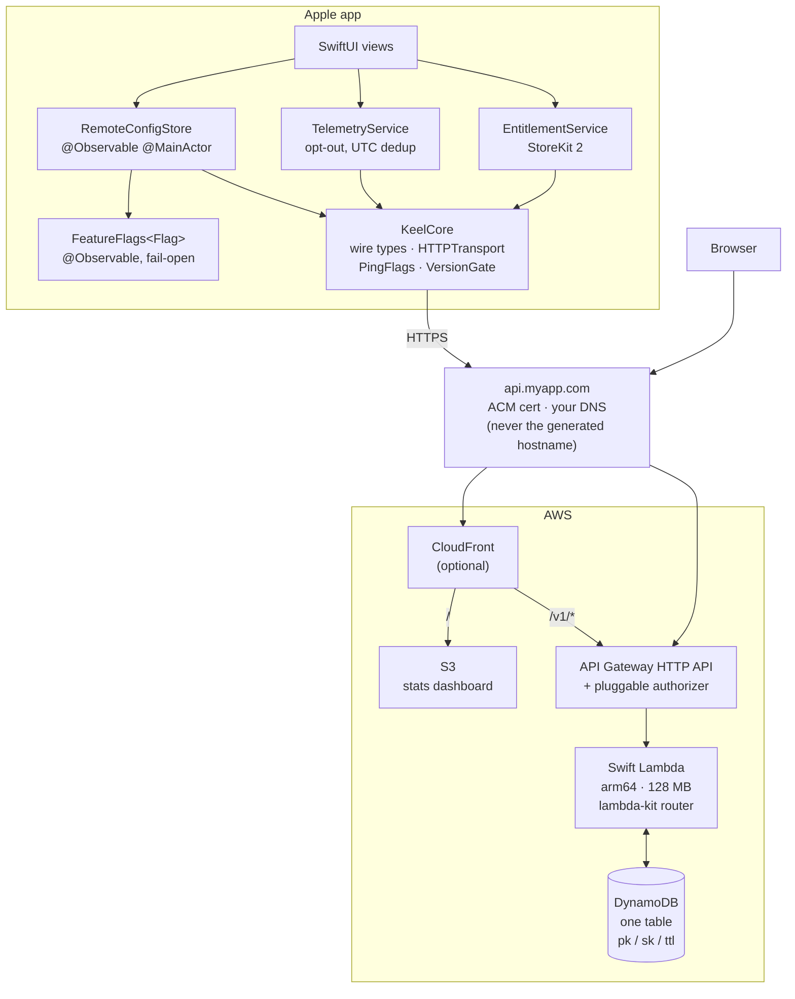
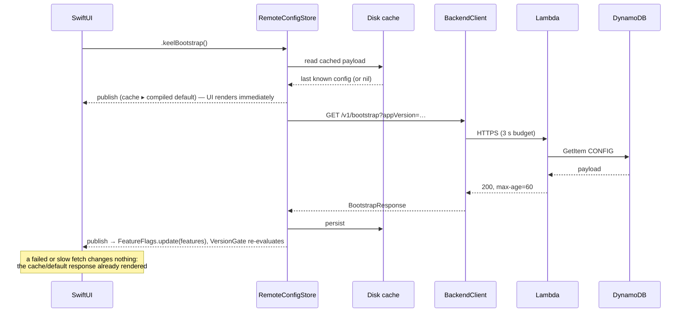
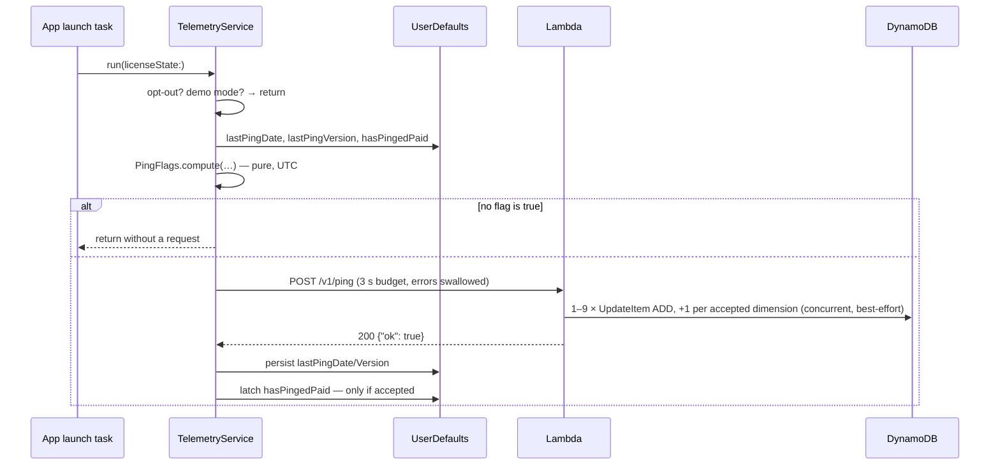
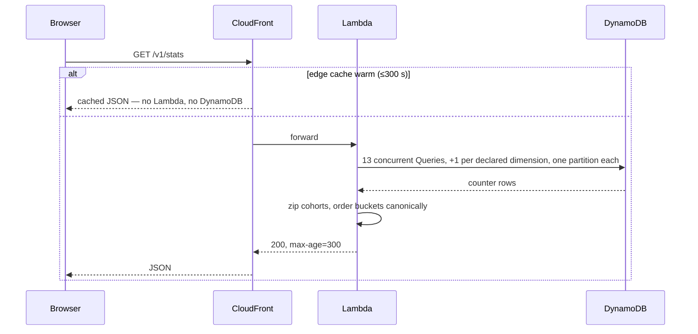

# Keel — Architecture Guide

Keel is an opinionated framework for the two services almost every one of my apps ends up
needing, and which I have now written three times:

- **Bootstrap** — remote configuration, feature flags, and a version gate, fetched once at
  launch so the app's behaviour can change without an App Store release.
- **Ping** — anonymous usage counters (installs, DAU, MAU, version and OS spread,
  conversions) with a public stats endpoint and a dashboard to read them.

It is opinionated about *structure* — directory layout, the HTTP contract, the DynamoDB
schema, Swift on the server — and deliberately unopinionated about *what your app is*.
Free, paid, IAP, subscription; iPhone, Mac, TV, Watch, Vision; with or without accounts.

## Contents

1. [Design principles](#1-design-principles)
2. [System overview](#2-system-overview)
3. [The HTTP contract](#3-the-http-contract)
4. [Data model](#4-data-model)
5. [Request flows](#5-request-flows)
6. [Client architecture](#6-client-architecture)
7. [Server architecture](#7-server-architecture)
8. [Infrastructure](#8-infrastructure)
9. [The privacy model](#9-the-privacy-model)
10. [Extension points](#10-extension-points)
11. [Cost model](#11-cost-model)
12. [Decisions](#12-decisions)

---

## 1. Design principles

**Grace-first.** No Keel call is ever on the critical path of a launch. Bootstrap has a
three-tier fallback (network ▸ disk cache ▸ compiled-in default) and telemetry is
fire-and-forget with a 3-second budget. A backend outage must be invisible to the user, and
must never remove a feature the app already shipped — every flag lookup is **fail-open**.

**No identifier, ever.** Telemetry carries no device identifier, no user id, no salt, and
no code path derives one. Deduplication happens on the *client* (`firstToday`,
`firstThisMonth`, …); the server trusts those booleans and only ever increments a counter.
This is a structural property, not a policy: there is no request field that could carry an
identifier and no table item keyed by anything device-specific. See §9.

**One table, one function.** A single DynamoDB table with a `pk`/`sk` pair and a TTL, and a
single Swift Lambda routing all endpoints. No GSI, no `Scan`, no fan-out of functions to
keep warm. This is what makes the whole backend cost cents at small scale (§11).

**Pure logic, injected effects.** Every decision — which counters a ping increments, whether
a version is gated, which flags win — is a pure function over values, unit-tested with fakes.
Stores are protocols; AWS appears only in one target on each side.

**The framework is a library, not a cage.** `KeelServer` mounts its routes onto *your*
router, so an app with its own endpoints (artwork, history, sessions) keeps one Lambda and
one deployment. `BootstrapResponse` carries an opaque, app-defined `app` payload, so your
domain model rides along in the same request that fetches flags.

---

## 2. System overview



The CloudFront layer is optional but recommended: it makes the dashboard and the API
same-origin (no CORS), and caches `/v1/stats` at the edge so visitor volume cannot drive
DynamoDB reads.

---

## 3. The HTTP contract

Three routes. Everything else an app needs, it adds itself.

| Method | Path | Auth default | Cache | Purpose |
|---|---|---|---|---|
| `GET` | `/v1/bootstrap` | app's choice | `max-age=60` | remote config, flags, version gate |
| `POST` | `/v1/ping` | app's choice | none | anonymous counters |
| `GET` | `/v1/stats` | public | `max-age=300` | published aggregates |

Optional, mounted only when the app opts in:

| Method | Path | Purpose |
|---|---|---|
| `POST` | `/v1/appstore-notification` | verify an App Store Server Notification v2 (verification only — the app decides what it means) |

### `GET /v1/bootstrap`

Query: `appVersion`, `platform`, `os`, `locale` — all optional. `appVersion` and `platform`
are what the version gate reasons about; omitting them yields an un-gated response.

```json
{
  "schemaVersion": 1,
  "generatedAt": "2026-08-24T10:00:00Z",
  "features": { "sleep_timer": true, "anniversary_cover": false },
  "gate": {
    "minSupportedVersion": "1.4",
    "recommendedVersion": "2.2",
    "updateURL": "https://apps.apple.com/app/id123456789",
    "maintenance": null
  },
  "telemetry": { "enabled": true, "dimensions": ["profiles"] },
  "urls": { "website": "…", "privacy": "…", "support": "…", "donation": "…" },
  "app": { "…whatever your app needs…" }
}
```

Every top-level key except `schemaVersion`, `generatedAt` and `telemetry` is optional and
omitted when empty, so the payload never carries `"features": {}`. `app` is opaque to the
framework: `BootstrapResponse<App: Decodable & Sendable>` decodes it into your type, and
`BootstrapResponse<Empty>` is the no-payload case.

**The `gate` section is already evaluated, and its presence is the signal.** The server
compares the requesting `appVersion` against the stored thresholds and sends only what
applies: a client on a current build gets no `gate` key at all, rather than a gate it has to
reason about. Within the section the same rule holds field by field — `minSupportedVersion`
appears only when this build is blocked, `recommendedVersion` only when it is behind. So a
client's whole job is "if it is there, it applies to me", and the semver comparison with all
its edge cases stays on the side a deploy can fix. It fails open in both directions: a client
that does not state its version, and a threshold the server cannot parse, both yield no gate
— blocking every install of a build over an unparseable string is the one outcome no
client-side change can undo, so it is warned about in the log instead.

Thresholds and the update URL can be **overridden per platform**, merged field by field over
the base values. This exists for one concrete reason: `updateURL` is not the same link on iOS,
macOS and Android, and sending a Mac user to the iPhone App Store is a dead end. Minimum
versions diverge for the same reason. A request that does not say which platform it is gets
the base values — the widest gate rather than no gate, so a blocked build stays blocked when
it fails to identify itself. `maintenance` is deliberately not overridable: a backend outage
is not per-platform, and a per-platform outage notice would be a way to state something that
cannot be true.

**`telemetry` is the server-side switch for the ping**, per app, changed with `keel config
set` and live within the 60-second cache. It is always present, even at its default, because
an operator reading a response should see the state of the kill switch rather than infer it
from a missing key. Three properties make it safe:

- **It fails open.** Absent decodes to `enabled: true`. A backend that is unreachable or not
  yet configured must not silently stop counting — "no data" and "no users" are
  indistinguishable afterwards, and there is no way to recover the difference.
- **It can only disable.** The client checks the user's local opt-out *first*; the server
  flag is consulted only if telemetry was going to be sent anyway. A remote switch able to
  re-enable collection for someone who declined would make `docs/PRIVACY.md` false.
- **Both sides enforce it.** The client reads its *cached* config and skips the request (so
  telemetry gains no ordering dependency on bootstrap); `PingHandler` reads the config item
  and writes nothing. Either alone is insufficient — a shipped build may never have fetched
  bootstrap, and the server cannot stop a request being made.

`dimensions` advertises which dimension names the server will accept. The server validates
against its own copy regardless, so this saves bytes and a rejected write; it is not the
boundary. If a deployment ever needs a switch that fails *closed* — a legal or regional
restriction — that is a second, separately named flag, not a change to this one.

**Alias routes.** A retrofit can declare extra paths for the same handler, optionally with
`envelope: flattened`, which emits the `app` payload's keys at the top level beside
`features`. That is the shape a pre-Keel client may already expect from its own bootstrap
endpoint, so shipped builds keep working while new ones move to `/v1/bootstrap`.

### `POST /v1/ping`

```json
{
  "firstPingEver": true,
  "firstToday": true,
  "firstThisMonth": true,
  "firstThisVersion": true,
  "firstPaidLaunch": false,
  "appVersion": "2.1.0",
  "osVersion": "26.1",
  "platform": "ios",
  "licenseState": "free",
  "dimensions": { "profiles": "3-5" }
}
```

→ `{ "ok": true }`

`platform` and `licenseState` decode into closed enums, so a typo is a 400 rather than a
junk partition nothing reads and nothing cleans up. `licenseState` is `free`, `trial` or
`paid`; an app without a trial simply never sends the middle one. `dimensions` carries
app-specific distributions as **pre-bucketed strings** — the raw number never leaves the
device — and both names and values are checked against an allowlist in the remote config.
`appVersion`/`osVersion` are capped at 20 ASCII bytes, because they are sort keys and an
unbounded string means an unbounded number of them.

A ping where all five booleans are false is a no-op, and the client does not send it. That is
what makes the second and every later launch of a day cost nothing at all.

The five `first*` booleans are the entire deduplication mechanism, computed on the client
(§6). The accuracy trade-off is deliberate and documented: a user who clears app data is
counted as a new install.

### `GET /v1/stats`

Everything the table holds, which is what makes §9's claim auditable rather than a promise:

```json
{
  "generatedAt": "2026-08-24T10:00:00Z",
  "installs": 12043, "conversions": 388,
  "dau": [{ "date": "2026-08-24", "count": 611 }],
  "dauByState": [{ "date": "2026-08-24", "free": 520, "trial": 0, "paid": 91 }],
  "mau": [{ "month": "2026-08", "count": 4102 }],
  "mauByState": [{ "month": "2026-08", "free": 3550, "trial": 0, "paid": 552 }],
  "versions": [{ "version": "2.1.0", "count": 2980 }],
  "osVersions": [{ "osVersion": "26.1", "count": 3310 }],
  "platforms": [{ "platform": "ios", "count": 3900 }],
  "dimensions": { "profiles": [{ "bucket": "3-5", "count": 820 }] }
}
```

Unlike bootstrap, **empty collections are emitted** rather than omitted: a dashboard has to
tell "no data in this window" from "this server has no such series", and a missing key cannot
say the first.

Every series is zero-filled across its whole window, from the calendar rather than from what
the query returned — a day with no pings is a `0` the chart needs, not a gap it has to
interpret. Cohort points carry all three license states as fields for the same reason: a
state nobody is in reads as `0` instead of vanishing, and a chart cannot tell an absent key
from a zero.

`versions`, `osVersions` and `platforms` are ordered descending by count. `dimensions` is
ordered by the bucket order the config declares, *not* by count, because a distribution read
out of its natural order is misleading. Buckets never observed are omitted rather than
zero-filled: unmeasured is not the same as zero.

There is deliberately no `conversionRate`. `conversions / installs` divides by an over-counted
denominator (§9), and publishing the quotient would launder that into a number that looks
precise. Both counts appear side by side instead.

`platforms[].platform` is a plain string, not the closed enum the ping uses, so a value
written by a newer server never 500s an older dashboard.

---

## 4. Data model

One table. `pk` (String), `sk` (String), TTL attribute `ttl`, on-demand billing, no GSI.

| Item | `pk` | `sk` | Attributes | TTL |
|---|---|---|---|---|
| Remote config | `CONFIG#current` | `v1` | `payload` (JSON string), `updatedAt` | — |
| Installs | `AGG#INSTALLS` | `TOTAL` | `count` | — |
| Conversions | `AGG#CONVERSIONS` | `TOTAL` | `count` | — |
| Daily active | `AGG#DAU` | `2026-08-24` | `count` | +400 d |
| Daily cohort | `AGG#DAU#free` · `AGG#DAU#trial` · `AGG#DAU#paid` | `2026-08-24` | `count` | +400 d |
| Monthly active | `AGG#MAU` | `2026-08` | `count` | +400 d |
| Monthly cohort | `AGG#MAU#free` · `AGG#MAU#trial` · `AGG#MAU#paid` | `2026-08` | `count` | +400 d |
| Version spread | `AGG#VER#2026-08` | `2.1.0` | `count` | +400 d |
| OS spread | `AGG#OS#2026-08` | `26.1` | `count` | +400 d |
| Platform spread | `AGG#PLAT#2026-08` | `ios` | `count` | +400 d |
| App dimension | `AGG#DIM#profiles#2026-08` | `3-5` | `count` | +400 d |

Every `AGG#` write is a single `UpdateItem` with `ADD #count :one`, which is an upsert and
is atomic across any number of concurrent devices — no read-modify-write, no conditional
expression, no contention. Every read is one `Query` on one partition key.

**Which boolean moves which counter.** This is the whole write path, and it is the part the
two existing implementations disagreed about:

| Boolean | Writes |
|---|---|
| `firstPingEver` | `AGG#INSTALLS` |
| `firstPaidLaunch` | `AGG#CONVERSIONS` |
| `firstToday` | `AGG#DAU`, `AGG#DAU#<state>` |
| `firstThisMonth` | `AGG#MAU`, `AGG#MAU#<state>`, `AGG#OS#<month>`, `AGG#PLAT#<month>`, `AGG#VER#<month>`, one `AGG#DIM#<name>#<month>` per accepted dimension |
| `firstThisVersion` | `AGG#VER#<month>` |

Two decisions in there are worth stating, because a hand-written backend can reasonably get
them wrong:

- **OS, platform and dimension spreads are monthly, not daily.** Incrementing the OS spread
  on `firstToday` makes its total a sum of daily actives — comparable to nothing else the
  backend publishes. Deduping monthly makes `sum(osVersions) ≈ mau`: one observation per
  install per month, the same census MAU takes.
- **The version spread is both monthly *and* on upgrade.** Driving it from `firstThisVersion`
  alone — the obvious choice — is subtly broken: that boolean fires once per install per version
  *ever*, so `AGG#VER#2026-09` would hold only the installs that changed version during
  September and none of the ones that stayed put. Adding the monthly census fixes it. An
  install that upgrades mid-month is then counted under both versions for that month, so
  `sum(versions)` can exceed `mau` — the honest reading of "was seen on this version this
  month", and better than a distribution that omits everyone who did not move.

The plan is de-duplicated before it is performed, which is what lets those two version rules
compose: a first launch that is also a new month writes `AGG#VER#<month>/<version>` once, not
twice. That bounds a single ping at nine writes plus one per accepted dimension, and it is
bounded by construction rather than by a limit somebody has to remember to check.

Note the two shapes, because the difference is easy to misread. **Time series** (`AGG#DAU`,
`AGG#MAU`) put the stamp in the *sort* key, so one Query with `sk >= …` returns a whole
window. **Distributions** (`AGG#VER#`, `AGG#OS#`, `AGG#PLAT#`, `AGG#DIM#`) put the stamp in
the *partition* key and the observed value in the sort key, so one Query returns every version
seen in a month. The stamp has to be in the partition there: a distribution's cardinality is
unbounded over time but bounded within a month, and monthly partitions are what keep the read
from growing forever.

Each cohort is its own partition rather than three attributes on one item, because `ADD` is
per-item and three attributes would serialise every ping of every state onto one hot key.
They exist so `free + trial + paid` reconciles against the plain `AGG#DAU` total: a built-in
sanity check on the client-side dedup that produced them. When it does not reconcile — a
partial write failure increments one counter and not the other — the discrepancy is left
visible rather than adjusted. A stats page that quietly corrects its own numbers is worse than
one that is occasionally off by one.

Keel writes none of the item kinds a purchase would imply. `KeelAppStore` verifies Apple's
paperwork and stores nothing — no `ENT#` entitlement item, no `TXN#` reverse pointer, no
`dynamodb:PutItem` grant. An app that records what a purchase grants owns those items in its own
key space, off its own `mount(appStore:)` handler; that is app data, not framework data, so §9
point 4 (no telemetry path reads a per-person row) still holds by construction — the framework
has no per-person row at all.

Every partition name is derivable from a request or a clock. That is what keeps the read path
`Query`-only: a key that needed discovery would need a GSI, and a GSI on a counter table is a
second copy of every write.

All of this lives in one type, `CounterSchema` — nothing else in the server builds a key by
string interpolation, so the table's shape can be read in one file and a rename is a compile
error rather than a silently orphaned partition.

**Compatibility.** These key names and stamp formats are a deliberate compatibility surface:
they match the aggregate-counter shape a bespoke telemetry backend typically writes, so a
retrofit needs no data migration — point the new handler at the existing table and the
history is intact. `AGG#PLAT#` and `AGG#DIM#` are additions. A pre-existing per-dimension
key such as `AGG#PROFILES#<month>` maps to `AGG#DIM#profiles#<month>`; that rename is
optional, since a legacy dimension name can be configured verbatim.

Timestamps use UTC everywhere, and the day/month stamps are computed with pure epoch
arithmetic (Howard Hinnant's `civil_from_days`) rather than `Calendar`, which is absent from
`FoundationEssentials` on Linux.

---

## 5. Request flows

### Launch



### Ping



The `firstPaidLaunch` ratchet latches only on a ping the server *accepted*: a conversion is
once per install, so a dropped one is lost forever, unlike a daily dedup boolean that simply
re-fires tomorrow. Latching before the server has accepted the ping loses conversions
outright, which is why the order matters here and not for the daily booleans.

### Stats



---

## 6. Client architecture

Two modules, so an app can ship the same Swift source to Android through Skip: Skip cannot
see `Observation`, `os.Logger`, or `StoreKit`, and confining them to one module keeps the
other transpilable.

**`KeelCore` — portable, no dependencies.** Wire types; `HTTPTransport` (a protocol) and
`URLSessionTransport` (guarded for `FoundationNetworking`); `BackendClient`, which races
every request against a 3-second budget in a task group so the budget binds fakes and future
adapters alike; and the pure decision logic: `PingFlags.compute`, `VersionGate.evaluate`,
`FeatureFlagSet`. No `Observation`, no `os.Logger` (a `KeelLog` protocol shim instead), no
`Calendar` outside a UTC helper.

**`KeelClient` — Apple platforms.**

- `RemoteConfigStore<App>` — `@Observable @MainActor`. Three-tier resolution, publishing the
  best answer it has at each step so the UI renders on the cached value and upgrades in
  place. The disk cache lives in Application Support, not `UserDefaults`: a config payload
  is arbitrary app JSON and can be large.
- `FeatureFlags<Flag>` — `@Observable @MainActor`, generic over your flag enum. Compiled-in
  defaults are the contract; a backend response *replaces* overrides wholesale rather than
  merging, so a flag the backend stopped mentioning reverts to its default instead of
  leaving a stale override behind. Unknown names are kept out but logged, so the backend can
  enable a flag before the client that reads it ships. Identical payloads short-circuit, so
  a re-fetch on foreground doesn't invalidate every observer.
- `TelemetryService` — the launch task. Opt-out (an *absent* preference key means enabled,
  which is the bug both existing apps had to fix), UTC day/month dedup, the conversion
  ratchet, and a demo-mode guard for App Review builds that must not touch the network.
- `EntitlementService` — StoreKit 2 → `LicenseState` (`free`/`trial`/`paid`), offline
  tolerant, on-device (the framework holds no server-side entitlement to cross-check).
- SwiftUI: `.keelBootstrap(_:)`, `.keelVersionGate(_:)` → `UpdateRequiredView` (blocking),
  `SoftUpdateBanner` (dismissible), `MaintenanceView`; and `TelemetryToggle` for Settings.

Dependency injection is by initialiser parameter throughout — no singletons except the one
`FeatureFlags` instance an app chooses to share, and no service locator.

---

## 7. Server architecture

One Lambda, `PROVIDED_AL2023` on arm64 at 128 MB. Cold-start work happens once, at module
scope: the `AWSClient`, the stores, the handlers, and the router are built before the first
invocation and reused for the life of the execution environment.

```
KeelServer            pure: wire types, CounterSchema, handlers, VersionGate,
                      RemoteConfig, ConfigCache, store protocols
KeelServerDynamoDB    DynamoDBCounterStore, DynamoDBConfigStore (soto)
KeelServerTesting     InMemoryCounterStore, InMemoryConfigStore, fixed clocks
KeelLambda            lambda-kit router + swift-configuration wiring (an executable
                      you can deploy as-is)
KeelAuthorizerLambda  shared-secret API Gateway authorizer
KeelAppStore          App Store JWS + notification verification (no entitlement model)
keel-cli              config get/set, stats dump, scaffolding
```

Handlers are `Sendable` structs whose only collaborators are store protocols and an injected
`@Sendable () -> Date` clock, so every branch is testable without AWS or a real clock.

`PingHandler` issues its 1–9 increments (plus one per accepted dimension) concurrently in a
`withDiscardingTaskGroup` and treats each as best-effort: a throttled counter loses one count,
which the next launch's dedup booleans will re-offer, and that is strictly better than failing
the request. `StatsHandler` fires its thirteen Queries — plus one per declared dimension —
with `async let` and task groups for the same reason: independent partitions should not be
read serially.

The two handlers differ on store failures, and the reasoning inverts in each case.
`PingHandler` swallows them, because a 500 teaches a client to retry a write that is not
idempotent. `BootstrapHandler` absorbs them, serving stale or default config, because a 500
there breaks every launching app at once. `StatsHandler` propagates them, because a page that
renders partial numbers as if they were complete is worse than one that says it could not
load — and it is edge-cached, nobody's launch depends on it, and a refresh is free.

Configuration comes from `swift-configuration`'s `ConfigReader`, layering environment
variables over a bundled JSON file, for the deployment-time knobs (`tableName`,
`configTTLSeconds`, `dauWindowDays`, alias routes). Product configuration — flags, gate,
URLs — is *not* here; it lives in DynamoDB so it can change without a deploy (§4). The one
exception is `FEATURE_FLAGS="a=true,b=1"`, an environment override for the case where the
table is unreachable or a flag must be flipped in seconds with
`update-function-configuration`. Malformed entries are dropped, not fatal, and surfaced in
the log — a typo must never take `/v1/bootstrap` down.

Alias routes use the same comma-separated shape:
`ALIAS_ROUTES="/station=bootstrap.flattened, /usage=stats"` — each entry is
`path=target`, the target being `bootstrap`, `ping` or `stats`, with `.flattened` allowed
on `bootstrap` only (nothing else has an `app` payload to hoist). Parsing is strict where
the flags are lenient, because the stakes invert: a dropped flag loses one override, a
dropped alias is a shipped client's route answering 404 — so it is logged at error level.

**Why soto, code-generated.** `aws-sdk-swift`'s aws-crt TLS layer crashes at Lambda cold
start. `scripts/generate-soto.sh` emits a minimal DynamoDB client from
soto's generator that depends only on `SotoCore`, which keeps the binary small and the cold
start short. lambda-kit's `DynamoQueries` `@Table` macro is not used for the counter table —
every write there is an `ADD` on a key the schema builds, which the macro doesn't model. (An
earlier design floated it for IAP entitlement items; those were removed from the framework —
`KeelAppStore` verifies and stores nothing — so there is no framework item left for it to model.)

---

## 8. Infrastructure

`@keel/cdk` exposes one L3 construct an app instantiates, plus optional siblings:

```ts
const backend = new KeelBackend(this, "Backend", {
  appName: "myapp",
  envName: "prod",
  auth: KeelAuth.sharedSecret({ parameterName: "/myapp/api-token" }),
  publicRoutes: ["/v1/stats"],
  aliasRoutes: { "/station": { route: "/v1/bootstrap", envelope: "flattened" } },
  domain: {
    domainName: "api.myapp.com",
    certificate: acm.Certificate.fromCertificateArn(this, "Cert", certArn),
  },
  reservedConcurrency: 10,
  budgetEmail: "me@example.com",
});

new KeelStatsSite(this, "Stats", { api: backend.httpApi, domainName: "myapp.com" });
```

It synthesizes the table, the function (code from the `AWSLambdaBuilder` plugin's zip, with
a placeholder fallback so `cdk synth` stays clean before the first build), a log group with
retention, the HTTP API and its routes, the authorizer and its SSM parameter when the auth
mode needs them, a CloudWatch alarm on function errors, and an optional monthly AWS Budgets
notification.

Auth is a strategy, not a fork of the construct:

| Mode | Mechanism | Use when |
|---|---|---|
| `none` | no authorizer | every route is public by design, and the app carries no credential |
| `sharedSecret` | Lambda authorizer comparing a header against an SSM parameter | you want casual abuse resistance without accounts |
| `iam` | `AWS_IAM`, SigV4 from Cognito Identity | the app already authenticates its users |
| `jwt` | HTTP API JWT authorizer | you have an OIDC issuer |

`publicRoutes` opts individual routes out, so `/v1/stats` stays readable by the dashboard
even when the rest of the API is authorized.

### The base URL must be a name you own

The base URL is compiled into shipped clients, so it is the one thing bootstrap cannot
change about an installed app. AWS's generated hostnames
(`<api-id>.execute-api.…`, `<hash>.lambda-url.…`) are derived from a resource id and change
whenever that resource is replaced — a region move, a stack rebuild, or a switch of front
door. Every install pointing at the old name then loses its flags, its kill switch, and its
version gate, permanently. So a production Keel deployment serves `/v1/…` under its own
domain from the first public release. `KeelBackend` annotates a warning when `envName` is
`prod` and `domain` is absent; dev and staging don't need it.

Two ways to get there, and they need certificates in **different regions**:

| Mechanism | ACM region | Use when |
|---|---|---|
| `KeelBackend`'s `domain` → `apigwv2.DomainName` + `ApiMapping` | the API's own region | backend only, or the dashboard is hosted elsewhere |
| `KeelStatsSite`'s `domainName` → CloudFront with an API origin | `us-east-1` | you also serve the dashboard, want it same-origin, and want `/v1/stats` edge-cached |

**The certificate is an input, never created by the construct.** CDK can only auto-validate
a DNS-validated certificate when it owns the hosted zone; with DNS hosted anywhere else —
a registrar, Cloudflare, any external provider — `CertificateValidation.fromDns()` with no
zone hangs the *first* deploy on a
validation CNAME nobody has created. Pass an `ICertificate`: a CDK-validated one if you're on
Route 53, `Certificate.fromCertificateArn` if you're not. `KeelBackend` outputs
`regionalDomainName` and `regionalHostedZoneId` to point an external provider at.

Two things that bite later rather than at deploy time: **leave the `_<hash>` validation CNAME
in place forever** — ACM auto-renews only while it resolves, so deleting it after issuance
breaks renewal 13 months on, with an email as the only warning — and in Cloudflare keep both
records **DNS-only, not proxied**, since an orange-cloud CNAME terminates TLS itself in front
of an endpoint whose certificate expects direct traffic.

`docs/adr/0007-stable-base-url.md` records this, including the client-side URL migration we
deliberately did *not* build.

Three pieces of hygiene are baked in as code, each learned the hard way:

- **Never `RETAIN` with a fixed `tableName` outside production.** A stack deletion or a
  resource replacement leaves an orphan table CloudFormation no longer tracks, and every
  later deploy fails with "already exists". Dev is `DESTROY`; production is `RETAIN` + PITR
  + deletion protection.
- **Reserved concurrency is opt-in.** A fresh AWS account's total concurrency limit is 10,
  and AWS requires ≥10 to remain unreserved, so *any* reservation is rejected until the
  limit is raised. The account cap already bounds cost there.
- **No environment-variable default that points at a resource which may not exist.** A
  missing `TABLE_NAME` fails loudly at init rather than sending every counter to a phantom
  table where the only symptom is stats that silently never move.

---

## 9. The privacy model

This is the framework's load-bearing property, and the reason the design looks the way it
does. If your app publishes a privacy policy, Keel is built so the policy can say all of
this and be literally true:

1. **No identifier is transmitted.** The ping payload is five booleans, three short strings,
   and optional pre-bucketed dimension values. There is no field that could carry an
   identifier.
2. **No identifier is derived.** No hashed machine id, no IDFV, no salt, no
   `CryptoKit` import on that path.
3. **No per-device row exists.** Every telemetry item is a counter many devices increment.
   The table cannot be queried for an individual, because there is nothing keyed by one.
4. **Nothing is correlated with authentication.** In `iam` mode the transport is signed, but
   the handler never reads the caller identity and never writes it anywhere.
5. **Raw counts stay on the device.** App-specific distributions are bucketed *before* the
   request, so the server cannot see "this device has exactly 7 profiles" even once.
   A zero bucket is omitted rather than sent, because "0" mostly measures unfinished
   onboarding and would skew the distribution.
6. **Nothing is logged.** No request body, no headers, no IP, no User-Agent. Error logs name
   the type that failed to decode, never the value.
7. **It's opt-out, and honestly defaulted.** An absent preference means enabled; the toggle
   suppresses the request entirely rather than sending a "disabled" flag.
8. **Everything collected is published.** `/v1/stats` returns every number the table holds.

`docs/PRIVACY.md` is a policy template that states exactly these claims, and the
`PrivacyInfo.xcprivacy` fragment in `Sources/KeelClient/Resources` declares the matching
manifest entries. Adding a device identifier to the ping is a privacy-policy change first
and a code change second.

---

## 10. Extension points

| You want to… | Do this |
|---|---|
| ship app-specific config | put it in the `app` payload; decode with `BootstrapResponse<YourType>` |
| add your own endpoints | build your own executable, `import KeelServer`, `builder.mount(keel: routes)`, add yours |
| add a distribution to the stats | add a name to `pingDimensions` in the remote config; send a bucketed value; the dashboard grows a chart |
| keep a legacy path alive | declare an alias route, optionally `flattened` |
| use a different data store | implement `CounterStore` / `ConfigStore` |
| authenticate differently | a `KeelAuth` strategy; the handlers are unchanged |
| run without CloudFront | `KeelBackend` alone with `domain`; the dashboard then needs CORS |
| host DNS outside Route 53 | validate the cert out-of-band, pass `Certificate.fromCertificateArn`, point a DNS-only CNAME at `backend.regionalDomainName` |

## 11. Cost model

At 10 000 monthly active devices, one launch each per day:

| Resource | Volume | Cost |
|---|---|---|
| Lambda invocations | ~300 k/month (ping + bootstrap) | free tier; ~$0.06 beyond |
| Lambda compute | 128 MB × ~40 ms | free tier; well under $1 |
| DynamoDB writes | ~2.2 WCU-units/day (2 ADDs on the first launch of a day; up to 9 plus one per dimension on the first of a month) | cents |
| DynamoDB reads | bootstrap: 1 per cold start per 60 s; stats: bounded by the edge cache | cents |
| API Gateway HTTP API | ~300 k requests | ~$0.30 |
| CloudFront + S3 | dashboard traffic | cents |

The shape that keeps this cheap: pings that cost *nothing* after the first launch of a day
(no flag true ⇒ no request at all), a warm-cached config read, and edge-cached stats.
Reserved concurrency plus an AWS Budgets alarm bound the worst case on a public endpoint.

## 12. Decisions

Recorded in `docs/adr/`:

- `0001` — one table, one function, `AGG#` counter schema
- `0002` — swift-aws-lambda-runtime 3.x and the lambda-kit fork
- `0003` — remote config in DynamoDB rather than SSM, S3, or environment variables
- `0004` — client-side deduplication and the no-identifier invariant
- `0005` — two client modules, so Skip stays possible
- `0006` — code-generated soto instead of aws-sdk-swift
- `0007` — the base URL is permanent: a custom domain from the first release
