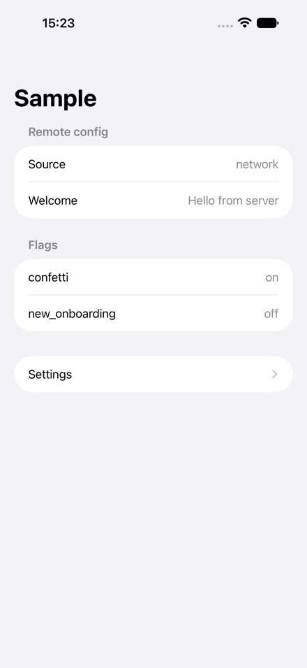
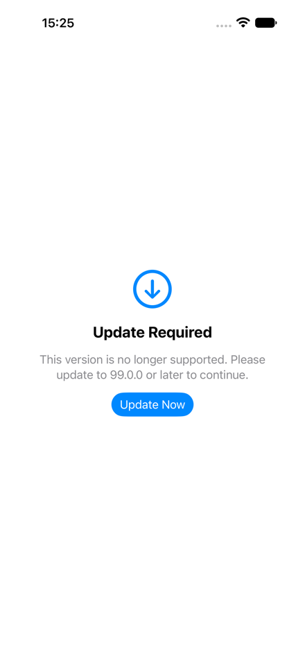
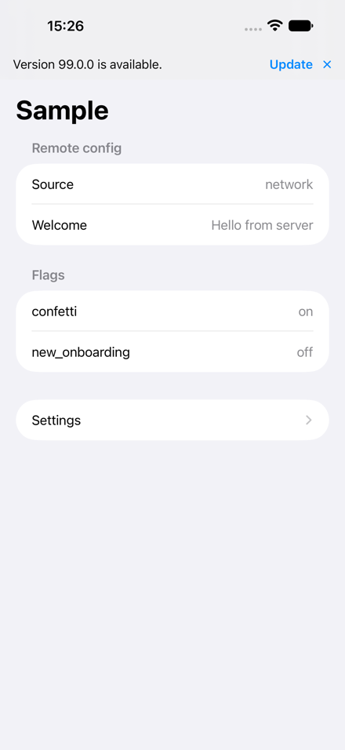
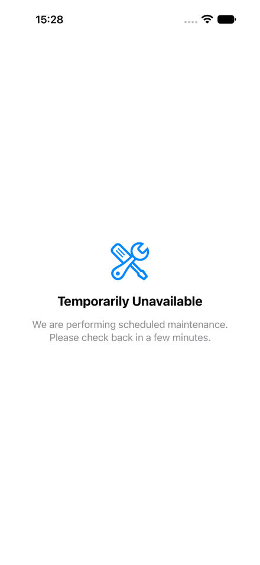
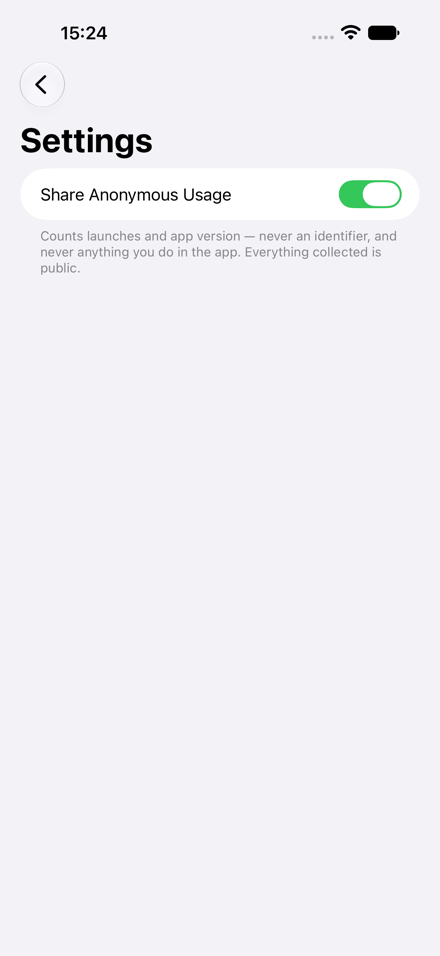

# Keel — Integration Guide

A hands-on guide for adopting Keel in your app. Covers the Swift client, server-side
control via the CLI, and the stats dashboard.

For background on *why* things are shaped the way they are, see
[ARCHITECTURE.md](ARCHITECTURE.md). For what Keel promises about user data, see
[PRIVACY.md](PRIVACY.md).

---

## Contents

**Part 1 — Client Integration (Swift)**

1. [Adding the dependency](#1-adding-the-dependency)
2. [Configuration](#2-configuration)
3. [Remote config and bootstrap](#3-remote-config-and-bootstrap)
4. [Feature flags](#4-feature-flags)
5. [Version gate](#5-version-gate)
6. [App payload](#6-app-payload)
7. [Telemetry](#7-telemetry)
8. [Custom dimensions](#8-custom-dimensions)
9. [Privacy](#9-privacy)
10. [Demo mode (App Review builds)](#10-demo-mode-app-review-builds)

**Part 2 — Server-Side Control (CLI)**

11. [Reading config](#11-reading-config)
12. [Setting feature flags](#12-setting-feature-flags)
13. [Version gate control](#13-version-gate-control)
14. [Telemetry kill switch](#14-telemetry-kill-switch)
15. [App payload](#15-app-payload-cli)
16. [Dimensions and full config replace](#16-dimensions-and-full-config-replace)
17. [Stats](#17-stats)
18. [Emergency overrides](#18-emergency-overrides)

**Part 3 — Backend Deployment**

19. [Prerequisites](#19-prerequisites)
20. [Scaffolding a new app](#20-scaffolding-a-new-app)
21. [Compiling the Lambda](#21-compiling-the-lambda-one-time-then-on-each-code-change)
    - [Adding your own routes: the lambda-kit fork and runtime pin](#adding-your-own-routes-the-lambda-kit-fork-and-runtime-pin)
22. [Creating the SSM parameter](#22-creating-the-ssm-parameter-one-time-sharedsecret-only)
23. [Deploying the stack](#23-deploying-the-stack)
24. [Custom domain, certificate, and DNS](#24-custom-domain-certificate-and-dns-production-one-time)
25. [Seeding the initial config](#25-seeding-the-initial-config)
26. [Deploy checklist](#26-deploy-checklist)

**App-owned routes (supplement to Part 3)**

- [App-owned routes](#app-owned-routes)
  - [Pointing the CDK construct at your executable](#pointing-the-cdk-construct-at-your-executable)
  - [DynamoDB grant for app-owned item kinds](#dynamodb-grant-for-app-owned-item-kinds)
  - [Worked example: Orthanc's Stripe routes](#worked-example-orthancs-stripe-routes)

**Part 4 — Dashboard**

27. [Stats dashboard](#27-stats-dashboard)

**Part 5 — App Store Verification (Optional)**

28. [Enabling App Store notifications in the CDK stack](#28-enabling-app-store-notifications-in-the-cdk-stack)
29. [App Store Connect: server notification URL](#29-app-store-connect-server-notification-url)
30. [Client-side: EntitlementService](#30-client-side-entitlementservice)
31. [Server-side: verifying notifications with `mount(appStore:)`](#31-server-side-verifying-notifications-with-mountappstore)
32. [Calling Apple's App Store Server API](#32-calling-apples-app-store-server-api)
33. [The HTTP contract (App Store notification route)](#33-the-http-contract-app-store-notification-route)
34. [Full wiring example (with App Store notifications)](#34-full-wiring-example-with-app-store-notifications)

---

# Part 1 — Client Integration (Swift)

<p align="center">
  
</p>

## 1. Adding the dependency

Keel is a Swift package with zero third-party dependencies. Add it in Xcode or in your
`Package.swift`:

```swift
dependencies: [
    .package(url: "https://github.com/your-org/KeelFramework.git", from: "1.0.0"),
]
```

Then add the targets you need:

| Target | Use when |
|---|---|
| `KeelClient` | Apple-platform app (iOS, macOS, tvOS, watchOS, visionOS) — includes SwiftUI views, `@Observable` stores, and StoreKit integration |
| `KeelCore` | Cross-platform or Skip-transpiled module — wire types, transport, and pure decision logic only |
| `KeelClientSigning` | Apple-platform production module — the reference `KeelSigV4Transport` for apps behind `KeelAuth.iam()` |
| `KeelClientTesting` | Your test target — fakes and in-memory stores for unit tests |

In your app target:

```swift
.target(
    name: "MyApp",
    dependencies: [
        .product(name: "KeelClient", package: "KeelFramework"),
    ]),
```

Import both modules in files that use Keel:

```swift
import KeelClient
import KeelCore
```

`KeelClient` re-exports nothing from `KeelCore`, so import both when you need wire types
(like `Platform` or `LicenseState`) alongside the stores.

## 2. Configuration

Everything starts with one `KeelConfiguration`, built in your `@main` type:

```swift
@main
struct MyApp: App {
    private static let keel = KeelConfiguration(
        baseURL: URL(string: "https://api.myapp.com")!,
        flagDefaults: AppFlag.flagDefaults)

    // ...
}
```

`KeelConfiguration` is `@MainActor` because it detects the platform at init time (reading
`UIDevice` on iOS). Build it where `@main` already puts you on the main actor.

### Parameters

| Parameter | Required | Default | Notes |
|---|---|---|---|
| `baseURL` | yes | — | The stable backend URL. **Must be a domain you own before the first public release** — see [ADR 0007](adr/0007-stable-base-url.md). AWS-generated hostnames die when the resource is replaced. |
| `authorization` | no | `.none` | `.sharedSecret(...)` for header-based auth, or `.none` for public backends. |
| `flagDefaults` | no | `[:]` | The compiled-in flag defaults — use `AppFlag.flagDefaults` (derived from your enum). |
| `appVersion` | no | `CFBundleShortVersionString` | Auto-detected from the bundle. |
| `platform` | no | auto-detected | Reads `UIDevice.current.userInterfaceIdiom` to distinguish iOS from iPadOS. |
| `isDemoMode` | no | `{ false }` | Return `true` in App Review demo builds to suppress all network calls. |

The remaining parameters (`transport`, `defaults`, `log`, `now`) are dependency-injection
seams for testing. Production code uses the defaults.

## 3. Remote config and bootstrap

`RemoteConfigStore<App>` is the observable window onto your app's remote configuration.
It manages a three-tier fallback:

1. **Network** — fetches `GET /v1/bootstrap` with a 3-second budget
2. **Disk cache** — the last successful response, persisted in Application Support
3. **Compiled-in defaults** — every flag at its default, no gate, no app payload

The UI renders immediately with the best tier available. A backend outage is invisible
to the user.

```swift
@State private var config = RemoteConfigStore<AppPayload>(configuration: Self.keel)

var body: some Scene {
    WindowGroup {
        ContentView()
            .environment(config)
            .task {
                await config.bootstrap()
            }
    }
}
```

`bootstrap()` publishes the disk cache first (so the UI has last-known-good data before
the network responds), then refreshes from the network. On success, it persists the new
response and publishes it — the UI updates in place.

On failure, the current tier stays. A stale config beats no config.

### Reading the response

```swift
@Environment(RemoteConfigStore<AppPayload>.self) private var config

// Where the response came from
config.source          // .none, .diskCache, or .network

// The app's own payload (see §6)
config.app?.welcomeMessage

// The version gate decision (see §5)
config.gateDecision    // .proceed, .softUpdate, .blocked, or .maintenance

// The telemetry config (see §7)
config.telemetry       // passed to TelemetryService

// Well-known URLs
config.url(KeelURL.privacy)   // URL? — absent if the server didn't state it
config.url(KeelURL.support)
```

## 4. Feature flags

Flags are typed by an enum you define, with compiled-in defaults that the server can
override at runtime.

### Declaring your flags

```swift
enum AppFlag: String, KeelFlag {
    case confetti = "confetti"
    case newOnboarding = "new_onboarding"

    var defaultValue: Bool {
        switch self {
        case .confetti: false
        case .newOnboarding: false
        }
    }
}
```

Every case has a `defaultValue` — this is a required member of `KeelFlag`, so a new flag
without a decision is a compile error.

The `rawValue` is the wire name — what the server sends in the `features` dictionary.
Keep them stable: renaming a wire name silently reverts to the default for every shipped
build that knows the old name.

### Using flags

```swift
@State private var flags = FeatureFlags<AppFlag>()

// In your body:
ContentView()
    .environment(flags)
    .task {
        await config.bootstrap()
        flags.update(from: config.response?.features ?? [:])
    }
```

Read flags with the typed subscript:

```swift
@Environment(FeatureFlags<AppFlag>.self) private var flags

if flags[.confetti] {
    // 🎉
}
```

A typo in the flag name is a compile error, not a silent `false`.

### How overrides work

The server sends a `features` dictionary in the bootstrap response:

```json
{ "features": { "confetti": true, "new_onboarding": false } }
```

`update(from:)` applies these as a **wholesale replace**: a flag the server stops
mentioning reverts to its compiled-in default. There is no "merge" — this prevents
stale overrides from persisting after the server removes a flag.

Flags the server sends that this build has no case for are carried silently (visible via
`flags.unknownServerFlags` for a debug screen). This lets the server enable a flag before
the client that reads it ships.

### The fail-open guarantee

If the server is unreachable, or the response has no `features` key, every flag reads as
its compiled-in default. A shipped feature never depends on the network saying yes.

## 5. Version gate

The version gate lets you block old builds, nudge users to update, or take the app offline
for maintenance — all without an App Store release.

Apply it at the **root of your view hierarchy, outside navigation**:

```swift
ContentView()
    .keelVersionGate(config.gateDecision)
```

A blocked build must not be navigable around.

### The four states

| State | Trigger | UI |
|---|---|---|
| `.proceed` | No gate in the response, or the build is current | Nothing — the app runs normally |
| `.softUpdate` | Server sets `recommendedVersion` higher than this build | A dismissible banner at the top of the safe area |
| `.blocked` | Server sets `minSupportedVersion` higher than this build | A full-screen dead end — no dismiss, no navigation |
| `.maintenance` | Server sets `gate.maintenance` with a message | A full-screen notice (optionally dismissible via `allowsDismissal`) |

### Screenshots

<p align="center">
  
  &nbsp;&nbsp;
  
  &nbsp;&nbsp;
  
</p>
<p align="center"><em>Left to right: blocked build, soft update nudge, maintenance mode</em></p>

### How it works

The **server** compares the requesting build's `appVersion` against the stored
thresholds. It only sends the fields that apply — so the client's job is pure
presence-checking, not semver comparison:

- `minSupportedVersion` appears → this build is blocked
- `recommendedVersion` appears → this build is behind
- `maintenance` appears → the operator took the backend down

Precedence: maintenance > blocked > soft update > proceed.

The version gate evaluation and the semver comparison live server-side — the side a deploy
can fix. The client never parses version strings.

### Server-side control

See [§13](#13-version-gate-control) for the CLI commands that trigger each state.

## 6. App payload

The `app` key in the bootstrap response carries your app's own configuration — whatever
you need at launch that should be changeable without a release. Keel is opaque to it:
you define the type, Keel decodes it.

### Defining your payload

```swift
struct AppPayload: Sendable, Equatable {
    var welcomeMessage: String?
}

extension AppPayload: Decodable {
    nonisolated init(from decoder: any Decoder) throws {
        let container = try decoder.container(keyedBy: CodingKeys.self)
        welcomeMessage = try container.decodeIfPresent(String.self, forKey: .welcomeMessage)
    }

    private enum CodingKeys: String, CodingKey {
        case welcomeMessage
    }
}
```

The `nonisolated init(from:)` is required under strict concurrency — the `Decodable`
requirement must be satisfied in a `nonisolated` context because
`RemoteConfigStore` constrains `App: Decodable & Sendable`.

### Using it

```swift
@State private var config = RemoteConfigStore<AppPayload>(configuration: Self.keel)

// In a view:
if let message = config.app?.welcomeMessage {
    Text(message)
}
```

If your app has no custom payload, use `Empty`:

```swift
@State private var config = RemoteConfigStore<Empty>(configuration: Self.keel)
```

### Setting it server-side

```sh
keel config set app.welcomeMessage "Hello!" --table $TABLE_NAME
```

See [§15](#15-app-payload-cli) for more.

## 7. Telemetry

`TelemetryService` sends a single anonymous ping at launch — no identifier of any kind,
ever. It runs fire-and-forget with a 3-second budget; failure is silent and the same
data re-offers itself next launch.

### Wiring it up

```swift
.task {
    await config.bootstrap()
    flags.update(from: config.response?.features ?? [:])

    await TelemetryService(configuration: Self.keel).run(
        licenseState: .free,       // or .trial, .paid
        telemetry: config.telemetry)
}
```

Call `run(...)` from the same root `.task`. It reads the telemetry section from the
*cached* config (not the network response), so there is no ordering dependency on
bootstrap completing.

### What it sends

Five deduplication booleans, computed on the device:

| Boolean | Meaning | Increments |
|---|---|---|
| `firstPingEver` | This install has never pinged before | Installs counter |
| `firstToday` | First launch of this UTC day | DAU, DAU-by-state |
| `firstThisMonth` | First launch of this UTC month | MAU, MAU-by-state, version/OS/platform spread |
| `firstThisVersion` | The app version changed | Version spread |
| `firstPaidLaunch` | First launch ever in a paid state | Conversions counter |

Plus the app version, OS version, platform, and license state.

If all five booleans are false, the request is not sent at all. The second launch of a day
costs zero requests.

### What it does not send

No device identifier, no user id, no salt, no hash, no cookie, no session — and no code
path derives one. The server only ever increments a shared counter. See
[PRIVACY.md](PRIVACY.md) for the full claim and [ARCHITECTURE.md](ARCHITECTURE.md) §9
for the mechanism behind each point.

### The opt-out toggle

Add `TelemetryToggle` to your settings screen:

```swift
struct SettingsView: View {
    var body: some View {
        Form {
            Section {
                TelemetryToggle()
            } footer: {
                TelemetryToggle.footer
            }
        }
        .navigationTitle("Settings")
    }
}
```

<p align="center">
  
</p>

The toggle reads and writes the same `UserDefaults` key that `TelemetryService` checks.
An absent key means enabled — the toggle only writes when touched, so users who never
open Settings are counted (the alternative silently disables telemetry for everyone).

**The user's opt-out wins over everything**, including the server's `telemetry.enabled`
flag. A remote switch can only turn collection *off*, never re-enable it for someone who
declined.

### Guard order

`TelemetryService.run(...)` checks, in this order:

1. User's local opt-out → return
2. Demo mode → return (App Review expects no network calls)
3. Server's kill switch (`telemetry.enabled`) → return
4. Compute dedup booleans → return if all false
5. Send the ping

This order is a policy statement: the user beats the server, the server beats the client.

## 8. Custom dimensions

App-specific distributions (e.g. "how many profiles does this user have") are bucketed
**on the device** before sending. The raw number never leaves the device.

```swift
await TelemetryService(configuration: Self.keel).run(
    licenseState: .free,
    dimensions: ["profiles": "3-5"],
    telemetry: config.telemetry)
```

The dimension name and bucket must match what the server declares in its
`telemetry.dimensions` allowlist. Unknown names are silently dropped by the client.

Bucket values are pre-bucketed strings — you compute the range yourself:

```swift
let profileCount = store.profiles.count
let bucket: String
switch profileCount {
case 1:       bucket = "1"
case 2:       bucket = "2"
case 3...5:   bucket = "3-5"
case 6...10:  bucket = "6-10"
default:      bucket = "11+"
}
```

There is deliberately no zero bucket. Unmeasured is not the same as zero.

### Declaring dimensions server-side

```sh
keel config replace --file config.json --table $TABLE_NAME
```

Where `config.json` includes:

```json
{
  "telemetry": {
    "enabled": true,
    "dimensions": [
      { "name": "profiles", "buckets": ["1", "2", "3-5", "6-10", "11+"] }
    ]
  }
}
```

The server validates against its own list regardless of what the client sends.

## 9. Privacy

Keel's privacy model is structural, not a policy. There is no request field that could
carry an identifier and no table item keyed by anything device-specific.

**What Keel collects:**

- Five yes/no dedup booleans (first launch ever, first today, first this month, first
  this version, first paid launch)
- App version, OS version, platform
- License state (free, trial, or paid)
- Pre-bucketed custom dimensions (if configured)

**What Keel does not collect:**

- No identifier of any kind — no device id, user id, advertising id, hashed machine id,
  cookie, or session token
- No IP address, request body, or User-Agent logged server-side
- No exact numbers — only pre-bucketed ranges
- No content from the app

**The trade-off:** A reinstall or cleared app data counts as a new install. Making that
number more accurate would require identifying the user, which is a worse deal.

**Everything is public.** Every counter the table holds is published at `/v1/stats`. If a
number is not on the stats page, it is not collected.

For the full privacy policy template, see [PRIVACY.md](PRIVACY.md). For the eight specific
claims and the mechanism behind each, see [ARCHITECTURE.md](ARCHITECTURE.md) §9.

---

## 10. Demo mode (App Review builds)

Some apps ship a special build for App Review that runs in a sandboxed "demo" mode —
no real backend, no network calls, no analytics. Keel supports this with a single
closure on `KeelConfiguration`.

### What it does

When `isDemoMode` returns `true`:

- **Telemetry is suppressed.** `TelemetryService.run()` returns immediately — no ping
  request leaves the device. This is checked *after* the user opt-out and *before* the
  server kill switch, so it cannot be overridden from the backend.
- **Bootstrap still runs normally.** The remote config fetch is not affected — the app
  still gets flags, the version gate, and the app payload. This is deliberate: a demo
  build should look and behave like a real build, it just shouldn't phone home with
  usage data.

The guard order inside `TelemetryService` is:

1. User's local opt-out → return
2. **Demo mode → return**
3. Server's kill switch (`telemetry.enabled`) → return
4. Compute dedup booleans → return if nothing new to report
5. Send the ping

### How to activate it

Pass `isDemoMode` when building the configuration. The closure is evaluated at every
ping, so you can toggle it at runtime:

```swift
private static let keel = KeelConfiguration(
    baseURL: URL(string: "https://api.myapp.com")!,
    flagDefaults: AppFlag.flagDefaults,
    isDemoMode: {
        // Launch argument set in the App Review build scheme
        CommandLine.arguments.contains("--demo-mode")
    })
```

Or use a compile-time flag:

```swift
isDemoMode: {
    #if DEMO_BUILD
    true
    #else
    false
    #endif
}
```

Or tie it to a runtime condition (e.g. TestFlight vs. App Store, a feature flag,
a server-side switch):

```swift
isDemoMode: { AppEnvironment.isAppReview }
```

### When to use it

- **App Review submissions** where Apple expects the app to work without real network
  activity. The bootstrap fetch is a GET with no side effects, so it's fine — but the
  ping writes counters, which could look like analytics-during-review to an automated
  scan.
- **Trade show / kiosk demos** where you want the full UI but no telemetry noise.
- **Automated UI tests** where pings would pollute your stats.

### When not to use it

- For the user's telemetry opt-out — that's `TelemetryToggle`, which persists in
  UserDefaults and beats everything including demo mode.
- For the server-side kill switch — use `keel config set telemetry.enabled false`
  instead, which also prevents the server from counting the ping even if one arrives.
- For offline testing — bootstrap already falls back to disk cache → compiled defaults
  gracefully. Demo mode is for "online but silent."

---

# Part 2 — Server-Side Control (CLI)

The `keel` CLI operates directly against the deployed DynamoDB table. Changes are live
within the 60-second config cache TTL — no deploy needed.

```sh
# Every command takes --table and optionally --region
keel config get     --table $TABLE_NAME
keel config set     <path> <value> --table $TABLE_NAME
keel config replace --file config.json --table $TABLE_NAME
keel stats dump     --table $TABLE_NAME
```

The table name is in the CloudFormation stack outputs (`ApiBaseUrl` and `TableName`).
Region defaults to `AWS_REGION` from the environment.

## 11. Reading config

```sh
keel config get --table $TABLE_NAME
```

Output:

```json
{
  "app" : {
    "welcomeMessage" : "Hello from server"
  },
  "features" : {
    "confetti" : true
  },
  "gate" : {
    "updateURL" : "https://stormacq.net"
  },
  "telemetry" : {
    "dimensions" : [
      {
        "buckets" : ["1", "2", "3-5", "6-10", "11+"],
        "name" : "profiles"
      }
    ],
    "enabled" : true
  },
  "urls" : {}
}
```

On a fresh stack with no config item, the empty defaults are printed and a note goes
to stderr:

```
(no config item stored; showing the empty defaults)
```

## 12. Setting feature flags

```sh
# Turn a flag on
keel config set features.confetti true --table $TABLE_NAME

# Turn a flag off
keel config set features.confetti false --table $TABLE_NAME

# Remove a flag (reverts to compiled-in default on clients)
keel config set features.confetti null --table $TABLE_NAME
```

The CLI does a read-modify-write through JSON: it reads the current config, sets the
path, validates the result by decoding it back into `RemoteConfig`, and writes it.
Invalid edits fail before anything touches the table.

Values are read as JSON: `true`, `false`, `null`, and numbers mean their JSON selves.
Anything else is treated as a string — so flag names and URLs need no shell-quoted quotes.

Live within ≤ 60 seconds (the Lambda's config cache TTL).

## 13. Version gate control

### Block a build (Update Required)

Force all builds below version 2.0 to show a blocking update screen:

```sh
keel config set gate.minSupportedVersion 2.0 --table $TABLE_NAME
```

The app shows a full-screen dead end with no dismiss option. Use this for builds that are
actively harmful (corrupt data, hammer an endpoint) — not for builds that are merely old.

### Soft update nudge

Suggest an update without blocking:

```sh
keel config set gate.recommendedVersion 2.1 --table $TABLE_NAME
```

A dismissible banner appears at the top of the screen. It returns next launch — the agreed
nagging cadence.

### Set the update URL

```sh
keel config set gate.updateURL "https://apps.apple.com/app/id123456789" --table $TABLE_NAME
```

This can be **overridden per platform** (the iOS App Store link is not the Mac one) via
`gate.platformOverrides` in a full config replace.

### Maintenance mode

Take the app offline with an explanation:

```sh
keel config set gate.maintenance.message "We are upgrading the backend. Back in 30 minutes." \
    --table $TABLE_NAME
```

To make it dismissible (lets users continue anyway):

```sh
keel config set gate.maintenance.allowsDismissal true --table $TABLE_NAME
```

### Clear the gate

```sh
keel config set gate.minSupportedVersion null --table $TABLE_NAME
keel config set gate.recommendedVersion null --table $TABLE_NAME
keel config set gate.maintenance null --table $TABLE_NAME
```

## 14. Telemetry kill switch

Disable all telemetry collection, both client-side (skips the request) and server-side
(writes nothing even if a request arrives):

```sh
keel config set telemetry.enabled false --table $TABLE_NAME
```

Re-enable:

```sh
keel config set telemetry.enabled true --table $TABLE_NAME
```

The kill switch fails **open** — an absent or unreachable config means telemetry stays
enabled. The purpose is operational control (cost, a broken build spamming counters),
not a privacy mechanism. The user's local opt-out is the privacy mechanism and always
wins.

## 15. App payload (CLI)

Set individual fields:

```sh
keel config set app.welcomeMessage "Hello!" --table $TABLE_NAME
```

Remove a field:

```sh
keel config set app.welcomeMessage null --table $TABLE_NAME
```

For nested structures, use the dot-path syntax:

```sh
keel config set app.onboarding.enabled true --table $TABLE_NAME
```

Intermediate objects are created automatically if they don't exist.

## 16. Dimensions and full config replace

For complex changes — adding dimensions, setting per-platform gate overrides, or resetting
the whole config — use `keel config replace` with a JSON file:

```sh
keel config replace --file config.json --table $TABLE_NAME
```

Or pipe from stdin:

```sh
cat config.json | keel config replace --table $TABLE_NAME
```

Example `config.json`:

```json
{
  "features": {
    "confetti": true,
    "new_onboarding": false
  },
  "gate": {
    "updateURL": "https://apps.apple.com/app/id123456789"
  },
  "telemetry": {
    "enabled": true,
    "dimensions": [
      { "name": "profiles", "buckets": ["1", "2", "3-5", "6-10", "11+"] }
    ]
  },
  "urls": {
    "privacy": "https://myapp.com/privacy",
    "support": "https://myapp.com/support"
  },
  "app": {
    "welcomeMessage": "Welcome to MyApp!"
  }
}
```

The file is decoded and validated *before* anything touches the table. A mistyped file
fails fast.

## 17. Stats

Print exactly what `GET /v1/stats` would return:

```sh
keel stats dump --table $TABLE_NAME
```

Options:

```sh
keel stats dump --days 30 --months 12 --table $TABLE_NAME
```

The output includes:

| Field | Meaning |
|---|---|
| `installs` | Total first-ever pings (over-counts due to reinstalls — see §9) |
| `conversions` | Total first-paid-launch pings |
| `dau` | Daily active devices, zero-filled across the window |
| `dauByState` | DAU broken down by `free` / `trial` / `paid` |
| `mau` | Monthly active devices |
| `mauByState` | MAU broken down by state |
| `versions` | App version spread (monthly census), descending by count |
| `osVersions` | OS version spread, descending by count |
| `platforms` | Platform spread (`ios`, `ipados`, `macos`, ...), descending by count |
| `dimensions` | Custom dimension buckets, ordered by declared bucket order |

There is deliberately no `conversionRate` — `conversions / installs` divides by an
over-counted denominator. Both numbers appear side by side instead.

Days with no pings show as `0`, not as missing entries — a zero the chart needs.
Dimension buckets that were never observed are omitted — unmeasured is not zero.

## 18. Emergency overrides

If the DynamoDB table is unreachable or you need a flag flipped in seconds (faster than
the 60-second cache TTL), set environment variables directly on the Lambda:

```sh
# Override feature flags
aws lambda update-function-configuration \
    --function-name MyApp-KeelLambda \
    --environment "Variables={FEATURE_FLAGS=confetti=true,new_onboarding=false}"
```

The format is `name=value` pairs, comma-separated. Malformed entries are dropped (not
fatal) and logged — a typo must never take `/v1/bootstrap` down.

This is a last resort. For normal operations, use `keel config set`.

### Alias routes

Legacy paths for backward compatibility with shipped clients during a migration:

```sh
# Set via CDK prop, not by hand
aliasRoutes: { "/station": { route: "/v1/bootstrap", envelope: "flattened" } }
```

`flattened` hoists the `app` payload's keys to the top level, reproducing a legacy
response shape. Only valid on bootstrap.

---

# Part 3 — Backend Deployment

The client and the CLI both talk to the Keel backend — a single Lambda behind an API
Gateway HTTP API, backed by one DynamoDB table. This part covers every step from a clean
checkout to a running stack in your AWS account. Most of these steps are one-time
operations; the recurring workflow is short.

## 19. Prerequisites

| Tool | Version | Why |
|---|---|---|
| **Swift** | 6.2+ (Xcode 26+) | Builds the Lambda and authorizer executables |
| **Node.js** | 20+ | Runs CDK and the construct library |
| **Apple container CLI** | latest | Cross-compiles Swift for Linux arm64 (musl) inside a container |
| **AWS CDK** | 2.266+ | Synthesizes and deploys the CloudFormation stack |
| **AWS CLI** | 2.x | One-time SSM parameter creation, emergency overrides |

Install the container CLI from [apple/container](https://github.com/apple/container) if
you don't have it. CDK is a dev dependency of the backend project, so `npx cdk` works
without a global install.

AWS credentials must be configured — either `~/.aws/credentials`, an SSO session, or
environment variables (`AWS_ACCESS_KEY_ID`, `AWS_SECRET_ACCESS_KEY`, `AWS_REGION`). CDK
reads `CDK_DEFAULT_ACCOUNT` and `CDK_DEFAULT_REGION` from the environment when the stack
does not hardcode them.

### Bootstrap CDK (once per account/region)

If you have never used CDK in this account + region:

```sh
npx cdk bootstrap aws://<ACCOUNT_ID>/<REGION>
```

This creates the CDK staging bucket and roles. You only do it once.

## 20. Scaffolding a new app

The quickest path is the scaffolding script, which copies `Templates/SampleApp/` and
renames everything:

```sh
scripts/keel-new.sh MyApp ~/code/MyApp
```

It prints the next steps:

```
Created ~/code/MyApp from the Keel template.

Next:
  1. cd ~/code/MyApp/backend && npm install && npx cdk deploy
  2. Set baseURL in App/MyApp.swift to the ApiBaseUrl output.
  3. Follow ~/code/MyApp/README.md for the Xcode project wiring.
```

If you prefer to wire the backend yourself, create a CDK project that depends on
`@keel/cdk` and instantiate `KeelBackend`. The SampleApp stack is the reference:

```ts
import * as cdk from "aws-cdk-lib";
import { KeelAuth, KeelBackend, KeelStatsSite } from "@keel/cdk";

export class MyAppStack extends cdk.Stack {
  constructor(scope: Construct, id: string, props: { envName: string } & cdk.StackProps) {
    super(scope, id, props);

    const backend = new KeelBackend(this, "Backend", {
      appName: "myapp",
      envName: props.envName,
      auth: KeelAuth.sharedSecret({ parameterName: "/keel/myapp/prod/api-secret" }),
      publicRoutes: ["/v1/stats"],
      domain: {
        domainName: "api.myapp.com",
        certificate: acm.Certificate.fromCertificateArn(this, "Cert", certArn),
      },
      budgetEmail: "you@example.com",
    });

    new KeelStatsSite(this, "Stats", {
      api: backend.httpApi,
    });
  }
}
```

The `package.json` needs `@keel/cdk` as a local dependency pointing at the framework's
`cdk/` directory:

```json
{
  "dependencies": {
    "@keel/cdk": "file:../path/to/KeelFramework/cdk",
    "aws-cdk-lib": "^2.266.0",
    "constructs": "^10.4.2"
  }
}
```

## 21. Compiling the Lambda (one-time, then on each code change)

The Lambda runs on `PROVIDED_AL2023` arm64, so it needs to be cross-compiled from macOS
to Linux. The Makefile wraps the command:

```sh
make lambda
```

Under the hood this runs:

```sh
swift package --disable-sandbox --package-path server \
    --allow-network-connections docker \
    lambda-build \
    --cross-compile container \
    --architecture arm64 \
    --products KeelLambda \
    --products KeelAuthorizerLambda
```

It uses Apple's container CLI to build inside a Linux container and produces two zip
files:

| Product | Output |
|---|---|
| `KeelLambda` | `server/.build/plugins/AWSLambdaBuilder/outputs/AWSLambdaBuilder/KeelLambda/KeelLambda.zip` |
| `KeelAuthorizerLambda` | `server/.build/plugins/AWSLambdaBuilder/outputs/AWSLambdaBuilder/KeelAuthorizerLambda/KeelAuthorizerLambda.zip` |

**You only need `KeelAuthorizerLambda` if you use the `sharedSecret` auth mode.** The
other modes (`none`, `iam`, `jwt`) don't deploy an authorizer Lambda.

The first build downloads dependencies and a Linux toolchain, which takes several
minutes. Subsequent builds are incremental.

**Placeholder fallback.** If you run `cdk synth` before building the Lambda, CDK deploys
a placeholder script that prints an error on invocation. This keeps synth and template
tests working without a Swift toolchain, but the deployed function won't serve requests.
Build the real zip before the first `cdk deploy`.

### Adding your own routes: the lambda-kit fork and runtime pin

Most apps deploy `KeelLambda` as-is. An app that has server routes of its own does **not**
fork it — it ships its own executable that depends on `KeelServer` + `KeelRouter` (plus
`KeelAppStoreRouter` if it verifies App Store notifications), calls `builder.mount(keel:)` to
add the framework routes, and registers its own routes on the same builder.
`server/Sources/KeelLambda/Lambda.swift` is the reference for that wiring.

Because your executable links Keel's server packages, it inherits two dependency pins Keel
carries, and it has to resolve the **same** ones or SPM won't produce a single coherent
build:

- **`swift-aws-lambda-runtime` on the 3.x line** (`3.0.0-rc1` today). Keel is on 3.x for the
  `LambdaRuntime` API, response streaming, and the `AWSLambdaBuilder` plugin CDK reads the
  zip from. Resolve the same 3.x major in your own package.
- **The `lambda-kit` fork, pinned by exact revision.** Keel's router uses the `Routing`
  library from `github.com/sebsto/lambda-kit` — a fork whose *only* change is widening the
  runtime pin to 3.x (upstream `SongShift/lambda-kit` still pins 2.6.x). `server/Package.swift`
  pins it to the exact revision `5b2b025635a872345e7711177fe5b56a5ce81fad` (the current HEAD
  of the fork's `support-runtime-3` branch) rather than tracking the branch, so a force-push
  can't quietly change what builds. An app mounting Keel beside its own Lambdas must resolve
  that same pin: depend on the same fork revision, or let SPM share Keel's resolution by not
  declaring a competing `lambda-kit` requirement.

**The fork is temporary.** It carries no behaviour of its own to preserve — it only widens a
version range. It goes away the moment upstream `lambda-kit` depends on
`swift-aws-lambda-runtime` v3, at which point Keel repoints the dependency at a tagged
upstream `lambda-kit` release. That is a `Package.swift`-only change with **no code** —
nothing imports anything the fork added, so a consuming app just re-resolves. See
[ADR 0002](adr/0002-lambda-kit-fork.md) for the decision and its full exit criteria.

## 22. Creating the SSM parameter (one-time, sharedSecret only)

If your auth mode is `sharedSecret`, the API expects a secret stored as an SSM
`SecureString` parameter. CloudFormation **cannot** create `SecureString` parameters —
that's an AWS limitation — so this is a manual, one-time step.

```sh
aws ssm put-parameter \
    --name /keel/myapp/prod/api-secret \
    --type SecureString \
    --value "$(openssl rand -base64 32)"
```

The parameter name must match the `parameterName` you pass to `KeelAuth.sharedSecret()`
in your CDK stack. A good convention is `/keel/<appname>/<env>/api-secret`.

Save the generated value — the client needs it in `KeelConfiguration.authToken`. You can
retrieve it later:

```sh
aws ssm get-parameter --name /keel/myapp/prod/api-secret --with-decryption --query Parameter.Value --output text
```

**Per-environment parameters.** Create one for each environment you deploy:

```sh
aws ssm put-parameter --name /keel/myapp/dev/api-secret   --type SecureString --value "$(openssl rand -base64 32)"
aws ssm put-parameter --name /keel/myapp/prod/api-secret  --type SecureString --value "$(openssl rand -base64 32)"
```

**Rotation.** After rotating the value with `put-parameter --overwrite`, the authorizer
Lambda must pick up the new secret. It reads the parameter at cold start and caches it for
the life of the execution environment. Force fresh cold starts with a no-op config update:

```sh
aws lambda update-function-configuration \
    --function-name <authorizer-function-name> \
    --description "Rotated secret $(date -u +%FT%TZ)"
```

**Skip this section entirely** if you use `none`, `iam`, or `jwt` auth.

## 23. Deploying the stack

### First deploy (dev)

```sh
cd backend
npm install
npx cdk deploy
```

CDK synthesizes the template and deploys it. On a fresh stack this creates the DynamoDB
table, the Lambda function, the HTTP API, a CloudWatch alarm, and a log group. The
outputs printed at the end include everything you need:

```
Outputs:
MyApp-dev.BackendApiBaseUrl  = https://abc123.execute-api.eu-west-1.amazonaws.com
MyApp-dev.BackendTableName   = MyApp-dev-BackendTableABC123-XYZ
```

Copy `ApiBaseUrl` into your `KeelConfiguration`'s `baseURL`. Copy `TableName` for the
CLI (`--table` flag, or export it as `TABLE_NAME`).

### Production deploy

Production differs in two ways: the table gets `RETAIN` + PITR + deletion protection,
and you should have a custom domain configured (see §24).

```sh
npx cdk deploy -c env=prod
```

The `env` context variable drives `envName` in the stack, which `KeelBackend` uses to
set the data-retention posture.

### Updating the Lambda code

After changing server code, rebuild and redeploy:

```sh
make lambda                  # cross-compile the new zip
cd backend && npx cdk deploy # CDK detects the changed asset and updates the function
```

CDK computes a hash of the zip file and only replaces the function when the asset has
actually changed.

### Verifying the deploy

Hit the bootstrap endpoint to confirm the stack is alive:

```sh
curl -s https://<ApiBaseUrl>/v1/bootstrap | python3 -m json.tool
```

On a fresh stack with no config item, you get the empty defaults:

```json
{
  "schemaVersion": 1,
  "generatedAt": "2026-08-28T12:00:00Z"
}
```

For a `sharedSecret` deployment, pass the token:

```sh
curl -s -H "Authorization: <your-secret>" https://<ApiBaseUrl>/v1/bootstrap | python3 -m json.tool
```

## 24. Custom domain, certificate, and DNS (production, one-time)

The base URL is compiled into shipped clients. AWS's generated hostnames
(`<api-id>.execute-api.…`) change when the resource is replaced — a region move, a stack
rebuild, a new API. Every install pointing at the old name then loses its flags, version
gate, and kill switch permanently. **Configure a domain you own before the first public
release.** (See `docs/adr/0007-stable-base-url.md` for the full rationale.)

Dev and staging don't need this — the generated hostname is fine, and `KeelBackend` only
warns when `envName` is `prod` and `domain` is absent.

### Step 1 — Choose the domain name

Pick a subdomain you own, e.g. `api.myapp.com`. This name goes into
`KeelConfiguration.baseURL` on the client and into the CDK prop on the server. It must
not change once a build is shipped.

### Step 2 — Create the ACM certificate

The certificate is an input to the construct, never created by it. How you create it
depends on where your DNS lives.

**Which region?** This matters:

| Mechanism | ACM region | Use when |
|---|---|---|
| `KeelBackend`'s `domain` (API Gateway custom domain) | **The stack's own region** (e.g. `eu-west-1`) | Backend only, or the dashboard is hosted separately |
| `KeelStatsSite` (CloudFront) | **`us-east-1`** (CloudFront's rule, regardless of stack region) | You also serve the dashboard same-origin |

If you use both, you need **two certificates** — one in the API region, one in
`us-east-1`. They can cover the same domain name.

#### Path A — DNS on Route 53

CDK can create and validate the certificate automatically:

```ts
import * as acm from "aws-cdk-lib/aws-certificatemanager";
import * as route53 from "aws-cdk-lib/aws-route53";

const zone = route53.HostedZone.fromLookup(this, "Zone", {
    domainName: "myapp.com",
});

const certificate = new acm.Certificate(this, "ApiCert", {
    domainName: "api.myapp.com",
    validation: acm.CertificateValidation.fromDns(zone),
});
```

CDK writes the DNS validation CNAME into Route 53 and waits for issuance. No manual
steps.

#### Path B — DNS on Cloudflare, Namecheap, or any external provider

Create the certificate with the AWS CLI in the **correct region**:

```sh
# For the API domain (KeelBackend) — use the stack's region
aws acm request-certificate \
    --domain-name api.myapp.com \
    --validation-method DNS \
    --region eu-west-1
```

The command prints a `CertificateArn`. Now retrieve the validation record:

```sh
aws acm describe-certificate \
    --certificate-arn arn:aws:acm:eu-west-1:123456789:certificate/abc-123 \
    --region eu-west-1 \
    --query 'Certificate.DomainValidationOptions[0].ResourceRecord'
```

Output:

```json
{
    "Name": "_a1b2c3d4e5.api.myapp.com.",
    "Type": "CNAME",
    "Value": "_x9y8z7.acm-validations.aws."
}
```

Create this CNAME record in your DNS provider. Then wait for ACM to validate:

```sh
aws acm wait certificate-validated \
    --certificate-arn arn:aws:acm:eu-west-1:123456789:certificate/abc-123 \
    --region eu-west-1
```

This blocks until the certificate is issued (usually 5–30 minutes). Once validated,
reference it in CDK:

```ts
import * as acm from "aws-cdk-lib/aws-certificatemanager";

const certificate = acm.Certificate.fromCertificateArn(
    this, "ApiCert",
    "arn:aws:acm:eu-west-1:123456789:certificate/abc-123");
```

**If you also use `KeelStatsSite`**, repeat the process in `us-east-1` for a second
certificate:

```sh
aws acm request-certificate \
    --domain-name myapp.com \
    --validation-method DNS \
    --region us-east-1
```

Same validation dance — create the CNAME, wait, then reference the ARN in
`KeelStatsSite`'s `certificate` prop.

### Step 3 — Add the domain to the CDK stack

```ts
const backend = new KeelBackend(this, "Backend", {
    appName: "myapp",
    envName: "prod",
    auth: KeelAuth.sharedSecret({ parameterName: "/keel/myapp/prod/api-secret" }),
    domain: {
        domainName: "api.myapp.com",
        certificate,   // from Step 2
    },
    // ...
});
```

Deploy:

```sh
npx cdk deploy -c env=prod
```

The stack outputs two values you need for DNS:

```
Outputs:
MyApp-prod.BackendRegionalDomainName  = d-abc123.execute-api.eu-west-1.amazonaws.com
MyApp-prod.BackendRegionalHostedZoneId = Z1UJRXOUMOOFQ8
```

### Step 4 — Create the DNS record

Point your domain at the API Gateway regional domain name.

#### Route 53

Add an alias record in CDK (or in the console):

```ts
import * as route53 from "aws-cdk-lib/aws-route53";
import * as targets from "aws-cdk-lib/aws-route53-targets";

new route53.ARecord(this, "ApiAlias", {
    zone,
    recordName: "api",
    target: route53.RecordTarget.fromAlias(
        new targets.ApiGatewayv2DomainProperties(
            backend.regionalDomainName!,
            backend.regionalHostedZoneId!)),
});
```

Or via the CLI:

```sh
aws route53 change-resource-record-sets --hosted-zone-id Z0123EXAMPLE \
    --change-batch '{
        "Changes": [{
            "Action": "CREATE",
            "ResourceRecordSet": {
                "Name": "api.myapp.com",
                "Type": "A",
                "AliasTarget": {
                    "HostedZoneId": "Z1UJRXOUMOOFQ8",
                    "DNSName": "d-abc123.execute-api.eu-west-1.amazonaws.com",
                    "EvaluateTargetHealth": false
                }
            }
        }]
    }'
```

#### Cloudflare or another external provider

Create a CNAME record:

```
Type:  CNAME
Name:  api
Target: d-abc123.execute-api.eu-west-1.amazonaws.com
```

### Step 5 — Verify

```sh
curl -s https://api.myapp.com/v1/bootstrap | python3 -m json.tool
```

You should get the bootstrap response. If the domain is not resolving yet, DNS
propagation can take up to a few minutes (usually seconds for Cloudflare, up to an
hour for some registrars).

### Things that bite later

**Leave the ACM validation CNAME in place forever.** The `_<hash>` record created in
Step 2 is not just for initial issuance. ACM auto-renews only while it resolves. Delete
it after issuance and renewal silently fails 13 months later, with an email as the only
warning. The record costs nothing — leave it.

**Cloudflare: keep records DNS-only (grey cloud), not proxied.** Both the validation
CNAME and the `api.myapp.com` CNAME must be grey-cloud (DNS-only). An orange-cloud
record terminates TLS at Cloudflare's edge and forwards to an endpoint whose ACM
certificate expects direct traffic — the result is a `403 Forbidden` from API Gateway.

**Domain renewal.** The domain must be renewed for as long as any installed app uses it,
which for the version gate to keep working, is indefinitely. Set it to auto-renew.

### Dashboard domain (KeelStatsSite)

If you serve the stats dashboard on the same domain (e.g. `myapp.com` for the dashboard,
`api.myapp.com` for the API), the CloudFront distribution needs its own certificate in
`us-east-1`:

```ts
new KeelStatsSite(this, "Stats", {
    api: backend.httpApi,
    domainName: "myapp.com",
    certificate: cloudFrontCert,   // must be in us-east-1
});
```

After deploying, the stack outputs `DistributionDomainName` — point your root domain at
it the same way (CNAME or alias). The distribution serves the dashboard at `/` and
proxies `/v1/*` to the API, so the page and its data are same-origin (no CORS).

## 25. Seeding the initial config

A freshly deployed stack has no config item — bootstrap returns the empty defaults and
every flag reverts to its compiled-in value. Seed it with `keel config replace`:

```sh
# Build the CLI (runs on macOS, talks to DynamoDB directly)
swift build --package-path server --product keel

# Set the table name from the stack output
export TABLE_NAME=<BackendTableName from cdk deploy output>

# Seed from a JSON file
server/.build/debug/keel config replace --file config.json --table $TABLE_NAME
```

A minimal starting `config.json`:

```json
{
  "features": {},
  "gate": {
    "updateURL": "https://apps.apple.com/app/id123456789"
  },
  "telemetry": {
    "enabled": true
  },
  "urls": {
    "privacy": "https://myapp.com/privacy",
    "support": "https://myapp.com/support"
  }
}
```

You can also set values one by one:

```sh
server/.build/debug/keel config set gate.updateURL "https://apps.apple.com/app/id123456789" \
    --table $TABLE_NAME
```

Verify:

```sh
server/.build/debug/keel config get --table $TABLE_NAME
```

The config is live within the Lambda's cache TTL (default 60 seconds).

## 26. Deploy checklist

A summary of every step, in order, for a new app going to production.

**One-time setup:**

1. `npx cdk bootstrap aws://<account>/<region>` — if CDK has never been used here
2. `make lambda` — cross-compile the Lambda zip(s)
3. Create the SSM parameter — `sharedSecret` auth only (see §22)
4. Create or import the ACM certificate for your domain (see §24)
5. Configure the CDK stack — `appName`, `envName`, `auth`, `domain`, `budgetEmail`
6. `cd backend && npm install && npx cdk deploy -c env=prod` — deploy the stack
7. Point your DNS at the `RegionalDomainName` output
8. Seed the initial config with `keel config replace` (see §25)
9. Set `baseURL` in `KeelConfiguration` to `https://api.myapp.com`

**Recurring (on each server code change):**

1. `make lambda` — rebuild
2. `cd backend && npx cdk deploy` — CDK detects the changed asset

**Recurring (config changes, no deploy needed):**

```sh
keel config set features.confetti true --table $TABLE_NAME
```

Live within 60 seconds, no Lambda restart.

---

# App-owned routes

Some apps need their own routes next to Keel's — a payment webhook, a license
check, a download redirect — while still using Keel's counters and config. You
don't fork `KeelLambda` to do this. You write your own Lambda executable that
depends on the `KeelServer` and `KeelRouter` libraries, mounts Keel's routes on
a shared router builder, adds your own routes, then builds the router.

The whole pattern is three steps:

```swift
import KeelRouter   // KeelRouter, and builder.mount(keel:)
import KeelServer   // handlers, ConfigCache, the store protocols
import Routing      // HTTPRouterBuilder

let builder = HTTPRouterBuilder()

// 1. Mount Keel's routes: /v1/bootstrap, /v1/ping, /v1/stats
builder.mount(keel: keel)

// 2. Add your own routes on the same builder
builder.post("/v1/my-webhook") { request, _ in
    try await MyWebhookHandler().handle(request)
}
builder.get("/v1/my-thing") { request, _ in
    try await MyThingHandler().handle(request)
}

// 3. Build once; the router serves both Keel's routes and yours
let router = builder.build()
```

You construct the `KeelRouter` yourself from its public initializer, so you own
every dependency it takes. The types you need are all public library API:

- `KeelServer` — the handlers (`BootstrapHandler`, `PingHandler`, `StatsHandler`),
  `ConfigCache`, and the `CounterStore` / `ConfigStore` protocols.
- `KeelServerDynamoDB` — `DynamoDBCounterStore` / `DynamoDBConfigStore`.
- `KeelRouter` — the `KeelRouter` type and `builder.mount(keel:)`.

`KeelLambda`'s own `makeRouterBuilder` in `server/Sources/KeelLambda/Lambda.swift`
does exactly this wiring, but it's `internal` to that executable target, so you
can't import it — copy the steps into your own executable. `AdopterSeamTests`
builds a router through this same public path, so if the seam ever became
import-only again the build would fail.

The full example below wires it all up with real DynamoDB stores.

## Pointing the CDK construct at your executable

`KeelBackend` has a `lambdaAssetPath` prop that takes the path to a compiled Lambda zip
file. Use it to point the construct at your own executable instead of `KeelLambda`:

```ts
const backend = new KeelBackend(this, "Backend", {
    appName: "myapp",
    envName: "prod",
    auth: KeelAuth.sharedSecret({ parameterName: "/keel/myapp/prod/api-secret" }),
    lambdaAssetPath: "path/to/MyAppLambda.zip",  // your executable, not KeelLambda
});
```

Build your executable the same way as `KeelLambda` (see §21). Register your own routes
on API Gateway by repeating the explicit-route CDK pattern from the framework's own
stack, or use the `aliasRoutes` prop for simple path remaps.

## DynamoDB grant for app-owned item kinds

Keel's default IAM grant gives the Lambda `UpdateItem`, `Query`, and `GetItem` on the
table — enough for counters and config. If your routes write their own DynamoDB item
kinds (e.g. Stripe checkout sessions, license rows, anything with `PutItem`), you need
an additional grant on the table itself:

```ts
// In your CDK stack, after creating the KeelBackend:
backend.table.grantWriteData(backend.lambdaFunction);
// Or, for a narrower grant (PutItem only):
backend.table.grant(backend.lambdaFunction, "dynamodb:PutItem");
```

The App Store notification prop (`appStoreNotifications`, §28) grants **no** `PutItem` — the
framework verifies Apple's paperwork and stores nothing per user. So if your own routes write
their own DynamoDB item kinds, grant `PutItem` directly on the table as shown above; there is no
framework prop that will hand it to you as a side effect.

## Worked example: Orthanc's Stripe routes

The following example shows how Orthanc would register its three Stripe-facing routes
(`POST /v1/checkout`, `POST /v1/stripe-webhook`, `GET /v1/license`) on the same Lambda
as Keel. This is documentation — the code lives in the Orthanc repo, not in Keel.

### main.swift

```swift
import AWSLambdaEvents
import AWSLambdaRuntime
import Configuration
import KeelRouter
import KeelServer
import KeelServerDynamoDB
import Logging
import Routing
import SotoDynamoDB
// Orthanc's own handlers — NOT part of KeelFramework
import OrthancBackendCore

@main
struct OrthancLambda: LambdaHandler {
    private let router: HTTPRouter

    init() throws {
        let settings = try Settings()
        var logger = Logger(label: "orthanc")
        logger.logLevel = settings.logLevel

        // 1. Build the Keel router from public library API and mount it on a shared builder.
        //    (KeelLambda.makeRouterBuilder is the reference for this wiring, but it lives in an
        //    executable target and cannot be imported — reproduce it here against the
        //    KeelServer / KeelRouter / KeelServerDynamoDB libraries. `settings` is your app's
        //    own configuration type.)
        let dynamoDB = DynamoDB(client: AWSClient())
        let counters = DynamoDBCounterStore(dynamoDB: dynamoDB, tableName: settings.tableName)
        let configs = DynamoDBConfigStore(dynamoDB: dynamoDB, tableName: settings.tableName)
        let cache = ConfigCache(
            store: configs, ttl: Double(settings.configTTLSeconds), logger: logger)
        let keel = KeelRouter(
            bootstrap: BootstrapHandler(
                cache: cache, flagOverride: settings.flagOverride, logger: logger),
            ping: PingHandler(store: counters, cache: cache, logger: logger),
            stats: StatsHandler(
                store: counters, cache: cache,
                dauWindowDays: settings.dauWindowDays,
                mauWindowMonths: settings.mauWindowMonths,
                logger: logger),
            corsConfig: CORSConfig(allowedOrigins: settings.allowedOrigins),
            logger: logger)

        let builder = HTTPRouterBuilder()
        builder.mount(keel: keel)   // Keel's routes on the shared builder

        // 2. Orthanc-specific dependencies (reuse the dynamoDB client from step 1)
        let licenseStore = DynamoDBLicenseStore(dynamoDB: dynamoDB, tableName: settings.tableName)

        // 3. SSM secret for Stripe webhook signature verification
        //    (read at cold start, same pattern as KeelAuthorizerLambda)
        let stripeSecret = try await SSMClient().getParameter(name: settings.stripeWebhookSecretPath)

        // 4. Register app routes alongside Keel's
        builder.post("/v1/checkout") { request, _ in
            try await CheckoutHandler(store: licenseStore).handle(request)
        }
        // Stripe sends raw bytes; the signature header is verified against the body
        builder.post("/v1/stripe-webhook") { request, _ in
            try await StripeWebhookHandler(
                store: licenseStore,
                webhookSecret: stripeSecret
            ).handle(request)
        }
        builder.get("/v1/license") { request, _ in
            try await LicenseHandler(store: licenseStore).handle(request)
        }

        self.router = builder.build()
    }

    func handle(
        _ event: APIGatewayV2Request, context: LambdaContext
    ) async throws -> APIGatewayV2Response {
        let response = await router.handle(HTTPRequest(event: event), logger: context.logger)
        return APIGatewayV2Response(
            statusCode: response.statusCode,
            headers: response.headers,
            body: response.body)
    }

    static func main() async throws {
        let handler = try await OrthancLambda()
        let runtime = LambdaRuntime(
            encoder: LambdaJSONOutputEncoder<APIGatewayV2Response>(JSONEncoder()),
            decoder: ProxySynthesizingDecoder(),
            body: handler.handle)
        try await runtime.run()
    }
}
```

### Things this example exercises

**SSM secrets.** Stripe's webhook secret is a `SecureString` parameter, read at cold
start so every invocation reuses the same value. Rotation: update the SSM parameter,
then force a cold start by touching the Lambda's config (see §22 for the pattern).

**Raw-bytes webhook.** Stripe signs the raw request body. `HTTPRequest.body` is already
decoded from base64 if needed, so `StripeWebhookHandler` reads `request.body` (a `Data`)
directly — no further decoding step.

**Extra IAM grant.** `DynamoDBLicenseStore` uses `PutItem` to write license records:

```ts
// In the CDK stack
backend.table.grant(backend.lambdaFunction, "dynamodb:PutItem");
```

**Route registration on API Gateway.** Keel's CDK registers only the Keel routes
(`/v1/bootstrap`, `/v1/ping`, `/v1/stats`, plus any aliases) on the HTTP API. Declare your
own routes with the `appRoutes` prop — it registers each route **and**, when `allowedOrigins`
is set, its `OPTIONS` preflight, so a browser making a non-simple cross-origin request (a JSON
`POST`, or any request with a custom header) clears preflight instead of 404ing at the gateway:

```ts
const backend = new KeelBackend(this, "Backend", {
    appName: "orthanc",
    envName: props.envName,
    auth: KeelAuth.sharedSecret({ parameterName: "/keel/orthanc/prod/api-secret" }),
    lambdaAssetPath: "path/to/OrthancLambda.zip",
    allowedOrigins: ["https://stormacq.net", "https://www.stormacq.net"],
    appRoutes: [
        { path: "/v1/checkout", method: "POST" },                 // configured authorizer
        { path: "/v1/stripe-webhook", method: "POST", public: true }, // Stripe calls it unauthenticated
        { path: "/v1/license", method: "GET" },
    ],
});
```

Each route's integration is `backend.lambdaFunction` — the same executable that mounts Keel's
routes and your own. A route defaults to the configured authorizer; set `public: true` for one
a third party calls without your credentials (a payment webhook). A declared path that collides
with a Keel route fails `cdk synth`.

A **simple** GET (a bare `fetch`, no custom headers) needs no preflight and works without an
`OPTIONS` route; a **non-simple** request (JSON `POST`, custom header) needs the preflight,
which `appRoutes` + `allowedOrigins` register for you. If you register routes by hand with
`backend.httpApi.addRoutes(...)` instead, remember to add the matching `OPTIONS` route yourself
(always public — the browser sends it without credentials).

---

# Part 4 — Dashboard

## 27. Stats dashboard

Everything Keel collects is published at `/v1/stats` and rendered by a static dashboard.
The dashboard is deployed as an S3 static site fronted by CloudFront, same-origin with
the API — no CORS needed.

### What it shows

- Install and conversion totals
- DAU and MAU charts, with license-state breakdowns
- Version, OS, and platform distribution charts
- Custom dimension bucket distributions
- All numbers zero-filled across their window

The dashboard reads `/v1/stats` on load. CloudFront caches the response for 5 minutes
(`max-age=300`), so visitor volume cannot drive DynamoDB reads.

### Deploying it

```ts
new KeelStatsSite(this, "Stats", {
    api: backend.httpApi,
    domainName: "myapp.com",   // optional — serves from the CloudFront distribution otherwise
});
```

The dashboard is restyled per app via `tokens.css` only — colors and fonts. The layout
and data binding are framework-provided and update with Keel.

---

# Part 5 — App Store Verification (Optional)

Server-side App Store verification is opt-in. Apps that don't need the server to react to
Apple's paperwork skip this entire part — the framework has no App Store surface when the
feature is not mounted, and the X.509 crypto dependencies stay out of the binary.

For apps that do, Keel's `KeelAppStore` module provides **verification only**: StoreKit 2 JWS
verification, App Store Server Notification v2 verification, and the `AppStoreServerJWT` token
signer for *calling* Apple's API. What a purchase *grants* — an entitlement, a credit balance,
a local unlock — is your app's business, not the framework's. Keel hands you a verified payload;
you decide what it means. The client-side `EntitlementService` still bridges StoreKit into the
`LicenseState` the rest of the framework speaks.

**When the server needs any of this.** Your server needs it when it hands out something that
costs you money, or when it must react to a refund without the client's cooperation. If your app
only unlocks local UI, on-device StoreKit verification is enough and no server check helps
against a patched client — skip this part.

## 28. Enabling App Store notifications in the CDK stack

Add the `appStoreNotifications` prop to `KeelBackend`:

```ts
const backend = new KeelBackend(this, "Backend", {
  appName: "myapp",
  envName: "prod",
  auth: KeelAuth.sharedSecret({ parameterName: "/keel/myapp/prod/api-secret" }),
  appStoreNotifications: {
    bundleId: "com.example.myapp",
    productIds: ["unlock_pro", "monthly_premium"],
  },
  // ...the rest of your props
});
```

This changes three things in the deployed stack:

| What | Why |
|---|---|
| One new route on the HTTP API | `POST /v1/appstore-notification`, always **unauthenticated** |
| `APP_STORE_BUNDLE_ID` and `APP_STORE_PRODUCT_IDS` environment variables | The Lambda reads them at cold start and configures the verifier / its handler |
| (nothing else) | No `dynamodb:PutItem` grant — the framework stores no per-user item |

**No entitlement storage.** Unlike an earlier design, the prop does *not* mount purchase or
entitlement routes and does *not* grant `PutItem`. Keel verifies the notification and calls your
handler; recording what it means (if anything) is your code, on your own item kinds, with a grant
you add yourself (see Part 3, "granting `PutItem` for your own routes").

**Always public.** `/v1/appstore-notification` is unauthenticated whatever your auth mode —
Apple's servers hold no credentials of yours, and the JWS signature *is* the authentication. The
CDK construct throws at synth if the route somehow collides with a core route.

**Product allowlist.** `productIds` is the set of product identifiers this backend expects,
passed to the function as `APP_STORE_PRODUCT_IDS`. The ready-made `KeelLambda` enforces it: a
notification whose inner transaction verifies and matches the bundle but names a product not in
this list is logged and ignored, so a receipt for another app sharing the bundle, or a SKU you
never shipped, grants nothing. List every product the app sells; update and redeploy when you
add one. (An app that writes its own `mount(appStore:)` handler decides for itself what to do
with the value.)

Redeploy the stack after adding the prop:

```sh
make lambda
cd backend && npx cdk deploy
```

## 29. App Store Connect: server notification URL

After deploying with the prop enabled, configure App Store Connect to send notifications to
your backend:

1. Open [App Store Connect](https://appstoreconnect.apple.com) → your app → General → App Information
2. Under **App Store Server Notifications**, set:
   - **Production Server URL**: `https://api.myapp.com/v1/appstore-notification`
   - **Sandbox Server URL**: the same URL (the verifier reads the environment from the
     JWS, not from which URL received it)
3. Select **Version 2 Notifications**

Apple sends notifications for refunds, revocations, renewals, expirations, and other
lifecycle events. Keel *verifies* each one and hands it to your handler; which types your
handler acts on is up to you.

**The notification URL must be the custom domain**, not the AWS-generated hostname — for
the same reason as the base URL (§24): Apple's configuration is permanent, and a replaced
API Gateway resource would silently break notification delivery.

## 30. Client-side: EntitlementService

`EntitlementService` is an `@Observable @MainActor` class that bridges StoreKit 2 into
the `LicenseState` enum (`free`, `trial`, `paid`) the rest of Keel speaks — the same
value the telemetry ping carries and the cohort charts split by. It is unaffected by the
server split: it is generic StoreKit plumbing that lives entirely on the device.

### Setup

Declare which products map to which state:

```swift
@State private var entitlements = EntitlementService(
    paidProducts: ["unlock_pro"],
    trialProducts: ["weekly_trial"]   // optional — omit if you have no trial
)
```

Start it from a root `.task`, alive for the scene's lifetime:

```swift
var body: some Scene {
    WindowGroup {
        ContentView()
            .environment(entitlements)
            .task { await entitlements.start() }
    }
}
```

`start()` refreshes once from StoreKit's local cache (fast, works offline), then follows
`Transaction.updates` — purchases, renewals, revocations, Ask to Buy — for the life of
the task.

### Reading the state

```swift
struct ContentView: View {
    @Environment(EntitlementService.self) var entitlements

    var body: some View {
        if entitlements.licenseState == .paid {
            ProFeatureView()
        } else {
            PaywallView()
        }
    }
}
```

`licenseState` starts as `.free` (the conservative default) and updates as StoreKit
responds. In practice the local cache answers fast enough that a paid user does not see
a flash of locked UI.

### The fold

The state logic is a pure fold: **paid beats trial beats free**. Revoked and expired
entitlements are filtered out before the fold runs. An auto-renewable past its
`expirationDate` entitles nothing, even if no `EXPIRED` notification has arrived yet.

### Feeding licenseState to telemetry

Pass the entitlement state to the telemetry ping so the dashboard's cohort charts
(DAU by free/trial/paid) reflect reality:

```swift
.task {
    await config.bootstrap()
    flags.update(from: config.response?.features ?? [:])

    await TelemetryService(configuration: Self.keel).run(
        licenseState: entitlements.licenseState,
        telemetry: config.telemetry)
}
```

The `firstPaidLaunch` boolean in the ping fires exactly once per install — the first
launch where a paid state is observed — and drives the `AGG#CONVERSIONS` counter.

## 31. Server-side: verifying notifications with `mount(appStore:)`

If your server must react to a notification — reverse a credit grant on a refund, flip your
own license row — mount the endpoint in your own executable. The helper owns the route path,
the raw-body read, the JWS verification, the failure→status mapping, and the 200 ack Apple
needs to stop retrying. You write only the side effect:

```swift
import KeelAppStore
import KeelAppStoreRouter

let verifier = NotificationVerifier()   // pins Apple Root CA G3
let builder = HTTPRouterBuilder()
builder.mount(keel: keel)
builder.mount(appStore: verifier, logger: logger) { notification in
    // `notification` is a verified `NotificationPayload` — Apple signed it.
    switch notification.notificationType {
    case .refund, AppStoreNotificationType(rawValue: "REVOKE"):
        guard let inner = notification.signedTransactionInfo else { return }
        let transaction = try await verifier.verifyTransactionInfo(inner)
        // your own storage: revoke what this transaction granted
        await myLicenseStore.revoke(transaction.originalTransactionId)
    default:
        break   // acknowledged and logged by the helper; act only on what you handle
    }
}
let router = builder.build()
```

The ready-made `KeelLambda` mounts this too when `appStoreNotifications` is set, but with a
handler that only verifies the inner transaction against the configured bundle and logs — it has
no app-specific state to touch. An app with real work to do writes the closure above in its own
executable.

### Why the payload types have no public initializer

`NotificationPayload` and `SignedTransactionInfo` can only be produced by the verifier — their
initializers are not public. Any function that takes one is therefore *provably* handling data
Apple signed; you cannot fabricate a "verified" payload and hand it to code that trusts it. For
tests, the `KeelAppStoreTesting` module exposes a factory (`KeelAppStoreFixtures`) that builds
these values without a real JWS.

### Notification types are an open enum

`AppStoreNotificationType` is a `RawRepresentable` open enum, not a closed one: `.refund` and
`.consumptionRequest` are named, and any other value — including a type Apple ships next year —
arrives as `AppStoreNotificationType(rawValue: "…")` rather than a decode failure. Switch on the
named constants and default the rest.

## 32. Calling Apple's App Store Server API

To *call* Apple (e.g. to answer a `CONSUMPTION_REQUEST`), `AppStoreServerJWT` signs and caches
the ES256 bearer token Apple's API expects:

```swift
let jwt = try AppStoreServerJWT(
    p8PEM: ascPrivateKeyPEM,     // your App Store Connect API key (.p8)
    keyID: "ABC123DEFG",
    issuerID: "…",
    bundleID: "com.example.myapp")
let bearer = try await jwt.token()   // reused until it nears expiry, then re-signed
```

Apps that only *receive* notifications never construct it, so they never link it.

## 33. The HTTP contract (App Store notification route)

One route, mounted only when the `appStoreNotifications` prop is present.

### `POST /v1/appstore-notification`

Auth: **none** (always public).

Request (Apple's format):

```json
{ "signedPayload": "<JWS>" }
```

Response: `200 {"ok": true}` when the payload verified and your handler returned; a non-2xx
(so Apple retries) when the payload was unverifiable or your handler threw. The specific
verification failure is logged, never returned — no progress meter for forgers.

## 34. Full wiring example (with App Store notifications)

Extending the basic "Putting it all together" example with server-side verification:

```swift
@main
struct MyApp: App {
    private static let keel = KeelConfiguration(
        baseURL: URL(string: "https://api.myapp.com")!,
        flagDefaults: AppFlag.flagDefaults)

    @State private var config = RemoteConfigStore<AppPayload>(configuration: Self.keel)
    @State private var flags = FeatureFlags<AppFlag>()
    @State private var entitlements = EntitlementService(
        paidProducts: ["unlock_pro"])

    var body: some Scene {
        WindowGroup {
            ContentView()
                .environment(config)
                .environment(flags)
                .environment(entitlements)
                .keelVersionGate(config.gateDecision)
                .task { await entitlements.start() }
                .task {
                    await config.bootstrap()
                    flags.update(from: config.response?.features ?? [:])

                    await TelemetryService(configuration: Self.keel).run(
                        licenseState: entitlements.licenseState,
                        telemetry: config.telemetry)
                }
        }
    }
}
```

The client just uses `EntitlementService` — there is no purchase call to the backend, because
the framework no longer stores entitlements. If your server reacts to refunds, that lives in your
own Lambda's `mount(appStore:)` handler (§31), and the CDK stack opts in:

```ts
const backend = new KeelBackend(this, "Backend", {
    appName: "myapp",
    envName: "prod",
    auth: KeelAuth.sharedSecret({ parameterName: "/keel/myapp/prod/api-secret" }),
    appStoreNotifications: {
        bundleId: "com.example.myapp",
        productIds: ["unlock_pro"],
    },
    domain: {
        domainName: "api.myapp.com",
        certificate: acm.Certificate.fromCertificateArn(this, "Cert", certArn),
    },
    budgetEmail: "you@example.com",
});
```

## Putting it all together

Here is the complete wiring for a new app — everything from `@main` to the settings
screen. This is what `Templates/SampleApp/` contains.

```swift
import KeelClient
import KeelCore
import SwiftUI

// 1. Declare your flags
enum AppFlag: String, KeelFlag {
    case confetti = "confetti"
    case newOnboarding = "new_onboarding"

    var defaultValue: Bool {
        switch self {
        case .confetti: false
        case .newOnboarding: false
        }
    }
}

// 2. Declare your app payload (or use Empty)
struct AppPayload: Sendable, Equatable {
    var welcomeMessage: String?
}

extension AppPayload: Decodable {
    nonisolated init(from decoder: any Decoder) throws {
        let container = try decoder.container(keyedBy: CodingKeys.self)
        welcomeMessage = try container.decodeIfPresent(String.self, forKey: .welcomeMessage)
    }
    private enum CodingKeys: String, CodingKey { case welcomeMessage }
}

// 3. Wire it up
@main
struct MyApp: App {
    private static let keel = KeelConfiguration(
        baseURL: URL(string: "https://api.myapp.com")!,
        flagDefaults: AppFlag.flagDefaults)

    @State private var config = RemoteConfigStore<AppPayload>(configuration: Self.keel)
    @State private var flags = FeatureFlags<AppFlag>()

    var body: some Scene {
        WindowGroup {
            ContentView()
                .environment(config)
                .environment(flags)
                .keelVersionGate(config.gateDecision)
                .task {
                    await config.bootstrap()
                    flags.update(from: config.response?.features ?? [:])

                    await TelemetryService(configuration: Self.keel).run(
                        licenseState: .free,
                        telemetry: config.telemetry)
                }
        }
    }
}
```

And the settings screen:

```swift
struct SettingsView: View {
    var body: some View {
        Form {
            Section {
                TelemetryToggle()
            } footer: {
                TelemetryToggle.footer
            }
        }
        .navigationTitle("Settings")
    }
}
```

---

## IAM transport contract

<a name="IAM-transport-contract"></a>

Keel backends can require AWS IAM (`iam`) authorization — each request must carry an
`Authorization: AWS4-HMAC-SHA256 ...` signature computed from the caller's IAM credentials.
`KeelCore` has no AWS or crypto dependency, so SigV4 signing belongs to the **app's own
`HTTPTransport`** rather than the framework. This section specifies the contract.

### When to use IAM auth

Configure `auth: KeelAuth.iam()` in the CDK stack when your users sign in with AWS
Cognito (or another AWS-identity provider) and you want API Gateway to enforce that each
caller holds a valid IAM credential. Typical for internal tools and developer-facing
APIs; for consumer apps, `sharedSecret` is simpler.

On the client, set `authorization: .none` on `BackendClient` and inject an `HTTPTransport`
that signs every outgoing request.

### The contract

An app-owned signing transport must:

1. **Receive** an `HTTPRequestData` from `BackendClient` — method, full URL, any
   client-set headers (e.g. `Content-Type: application/json`), and an optional body.
2. **Sign only when credentials exist.** If no IAM credentials are available (signed-out
   state, App Review demo mode, offline bootstrap) the request must be forwarded
   **unsigned and unmodified**. This is load-bearing: `/v1/bootstrap` and `/v1/stats`
   are declared `authorizationType: NONE` in the CDK stack and must work without
   credentials. A transport that always adds an `Authorization` header breaks those
   public routes.
3. **Hash the body** and set `x-amz-content-sha256` to the hex-encoded SHA-256. For
   requests with no body, use the hash of the empty string:
   `e3b0c44298fc1c149afbf4c8996fb92427ae41e4649b934ca495991b7852b855`.
   Do **not** choose `UNSIGNED-PAYLOAD` for AWS_IAM routes — API Gateway's IAM
   authorizer validates the content hash.
4. **Set `x-amz-security-token`** to the session token if the credential includes one
   (Cognito federated identities always do). The token must be included in the signed
   headers; omitting it causes a signature mismatch.
5. **Sign the request exactly as `BackendClient` built it.** Do not mutate headers or
   the body before computing the canonical request. Any change — even adding a header —
   invalidates the signature.
6. **Use an injectable clock.** The signer must accept a `() -> Date` dependency
   (defaulting to `{ Date() }`) so tests can inject a fixed timestamp and reproduce a
   golden signature byte-for-byte.
7. **Sign** with `AWS4-HMAC-SHA256` over the canonical request (method, URI path, query
   string, signed headers, body hash). The region and service are `execute-api`.
8. **Forward** the signed request to the underlying transport.
9. **Return** an `HTTPResponseData` from the response.

Header casing is case-insensitive at the transport boundary — `HTTPRequestData.headers`
uses lower-case keys by convention, but the AWS signing algorithm requires canonical
ordering, which you compute regardless.

### Reference implementation — `KeelSigV4Transport` (Apple / CryptoKit only)

`KeelClientSigning` ships a **real, tested SigV4 signer**: `KeelSigV4Transport`. It is
gated on `#if canImport(CryptoKit)` — CryptoKit is Apple-platform-only, which is why the
signer lives in its own Apple-platform library rather than in `KeelCore` (which stays
dependency-free and Skip-transpilable). `KeelClientSigning` is a **production** module, so
you depend on it from your shipping target — not from the test-support `KeelClientTesting`.
Your app gains a reference transport at zero extra dependency cost.

Key properties:
- **Signs only when credentials exist.** Pass `credentials: nil` and the request goes
  through unsigned — public routes work without any AWS session.
- **Injectable clock** via the `date: () -> Date` parameter. The default is `{ Date() }`.
  Override it in tests to pin `x-amz-date` and reproduce a deterministic signature.
- **Session token.** When `AWSCredentials.sessionToken` is non-nil, `x-amz-security-token`
  is added to the request headers and included in `SignedHeaders`.

```swift
import KeelCore
import KeelClientSigning

// Production: credentials from your Cognito identity pool (or wherever).
let transport = KeelSigV4Transport(
    inner: URLSessionTransport(),
    credentials: AWSCredentials(
        accessKeyId: credentials.accessKeyId,
        secretAccessKey: credentials.secretAccessKey,
        sessionToken: credentials.sessionToken),   // nil for long-term creds
    region: "eu-central-1")

let client = BackendClient(
    baseURL: URL(string: "https://api.example.com")!,
    authorization: .none,   // transport owns all authorization
    transport: transport)
```

For a production app that fetches short-lived Cognito credentials, rebuild the transport
(or replace the credentials) each time the session refreshes; there is no credential-refresh
hook inside the transport itself.

On Android / Skip, replace the `CryptoKit` HMAC calls with `javax.crypto.Mac` —
`KeelCore` has no dependency on either.

### Testing without AWS credentials

Two options depending on what you are testing.

**Option A — `RecordingSigningTransport` (cross-platform, no crypto)**

Records every request the transport receives; does not add any signing headers. Use
when you only need to assert that `BackendClient` handed the request to the transport:

```swift
import Testing
import KeelCore
import KeelClientTesting

@Test("Ping reaches the transport")
func pingReachesTransport() async throws {
    let recording = RecordingSigningTransport()
    await recording.inner.respond(to: "/v1/ping", body: #"{"ok":true}"#)

    let client = BackendClient(
        baseURL: URL(string: "https://api.example.com")!,
        authorization: .none,
        transport: recording)
    await client.send(ping: myPing)

    let requests = await recording.requests
    #expect(!requests.isEmpty)
    // The client itself adds no Authorization header — signing is the transport's job.
    #expect(requests.first?.headers["authorization"] == nil)
}
```

**Option B — `KeelSigV4Transport` with a `FakeTransport` inner (Apple / golden test)**

Use when you need to assert the signature value itself — the only way to catch
canonicalization bugs, wrong signed-header sets, or a broken session-token path:

```swift
#if canImport(CryptoKit)
import Testing
import KeelCore
import KeelClientSigning
import KeelClientTesting

@Test("SigV4 golden signature")
func goldenSignature() async throws {
    let fake = FakeTransport()
    await fake.respond(to: "/v1/ping", body: #"{"ok":true}"#)

    let transport = KeelSigV4Transport(
        inner: fake,
        credentials: AWSCredentials(
            accessKeyId: "AKIDEXAMPLE",
            secretAccessKey: "wJalrXUtnFEMI/K7MDENG+bPxRfiCYEXAMPLEKEY"),
        region: "eu-central-1",
        date: { fixedDate })   // inject deterministic clock

    _ = try await transport.send(HTTPRequestData(
        method: .post,
        url: URL(string: "https://api.example.com/v1/ping")!,
        body: Data(#"{"schemaVersion":1}"#.utf8)))

    let auth = try #require(await fake.requests.last?.headers["authorization"])
    #expect(auth.contains("Signature=91edb29d32b6cd7542559f8344cbd6887c368bc34dd6d6dcb7639f3f9b38d547"))
}
#endif
```

`Tests/KeelClientTests/SigV4GoldenTests.swift` contains the full pinned vector with
assertions on payload hash, canonical request, string-to-sign, final signature, and the
public-route guarantee (no `Authorization` header when `credentials: nil`).

---

## Quick reference

| What you want | Client | CLI |
|---|---|---|
| Flip a feature flag | reads automatically on next launch | `keel config set features.<name> true` |
| Block an old build | `.keelVersionGate(config.gateDecision)` | `keel config set gate.minSupportedVersion 2.0` |
| Nudge to update | same modifier | `keel config set gate.recommendedVersion 2.1` |
| Maintenance mode | same modifier | `keel config set gate.maintenance.message "..."` |
| Kill telemetry | honors the server flag | `keel config set telemetry.enabled false` |
| Change app config | reads `config.app?.…` | `keel config set app.<key> <value>` |
| See usage stats | — | `keel stats dump` or the dashboard |
| Emergency flag override | — | `FEATURE_FLAGS` env var on the Lambda |
